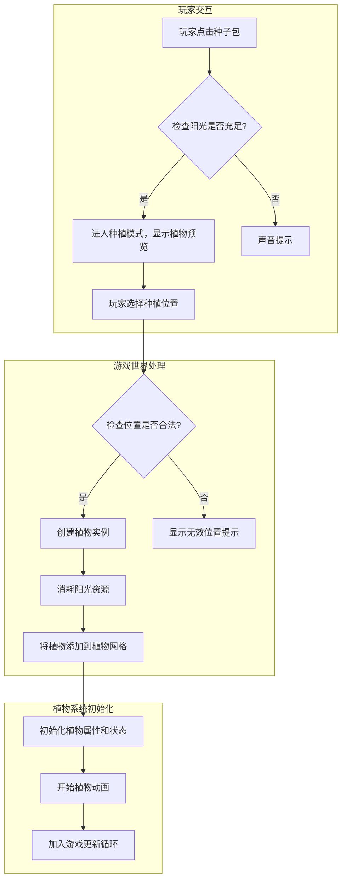
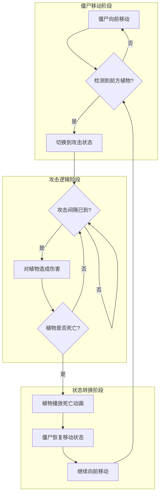
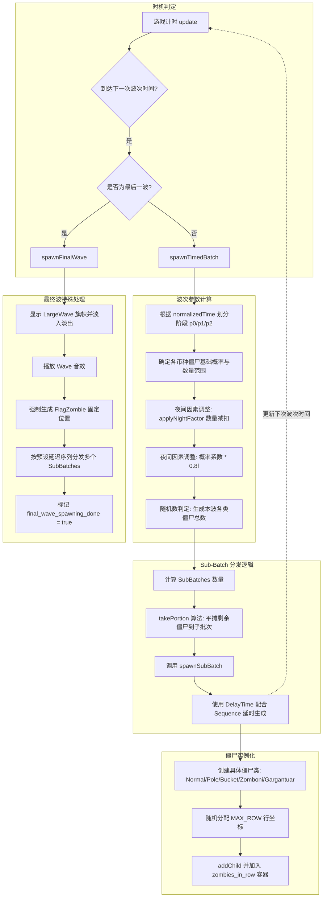

# 植物大战僵尸 - 系统架构设计文档
 > 版本: 1.0  
 > 最后更新: 2025年12月28日
## 📋 目录
 1. [项目概述](#项目概述)
 2. [架构总览](#架构总览)
 3. [核心组件设计](#核心组件设计)
 4. [接口设计](#接口设计)
 5. [系统交互流程](#系统交互流程)
 6. [实现状态与路线图](#实现状态与路线图)
## 项目概述
### 项目背景
本项目是基于Cocos2d-x游戏引擎开发的植物大战僵尸（Plants vs. Zombies）复刻版，旨在学习和实践2D游戏开发、面向对象设计和C++编程技术。游戏还原了经典塔防玩法，玩家通过种植不同功能的植物来抵御僵尸的入侵，同时需要管理阳光资源以维持防御体系。

### 开发环境
- **游戏引擎**：Cocos2d-x v3.17.2
- **开发语言**：C++
- **构建工具**：CMake
- **开发平台**：Windows 10/11 (Visual Studio 2019/2022)
- **资源管理**：Cocos2d-x AssetManager
- **版本控制**：Git

### 游戏类型
塔防类 (Tower Defense) / 策略类 (Strategy) / 2D休闲游戏

### 核心特性
- **植物防御系统**：支持14种功能各异的植物，包括攻击型、生产型、爆炸型等多种类型
- **僵尸波次系统**：动态生成6种僵尸类型，难度随波次递增
- **日夜交替模式**：白天/夜晚场景切换，影响阳光生成和植物生长
- **资源管理**：阳光和金币双资源系统，实现经济循环和策略深度

### 设计原则
- **组件化设计**：将游戏功能拆分为独立可复用组件，降低耦合度
- **面向对象**：充分利用继承、多态等OOP特性实现代码复用和扩展
- **数据驱动**：通过配置文件和枚举定义游戏参数和行为，便于平衡性调整
- **可扩展性**：设计灵活的接口和架构，方便添加新植物、僵尸和游戏模式
- **安全性**：采用Cocos2d-x的自动内存管理机制，避免内存泄漏

### 项目目标
- 实现经典植物大战僵尸游戏的核心玩法
- 展示面向对象设计和C++编程能力
- 构建可扩展的游戏架构，支持后续功能迭代
## 架构总览
### 高层架构图

```mermaid
graph TD
    subgraph scenes ["场景层 (Scenes)"]
        GameMenu[GameMenu 主菜单]
        SelectCardsScene[SelectCardsScene 选卡场景]
        ShopScene[ShopScene 商店场景]
        GameWorld[GameWorld 核心战斗场景]
    end

    subgraph core ["核心/管理层 (Core)"]
        AppDelegate[AppDelegate 应用入口]
        GameDefs[GameDefs 全局常量/枚举]
        PlayerProfile[PlayerProfile 玩家数据存档]
        Background[Background 背景与天气管理]
    end
    
    subgraph gameobjects ["游戏对象基础 (GameObjects)"]
        GameObject[GameObject 游戏对象基类]
        SeedPacket[SeedPacket 种子包]
        SelectCard[SelectCard 选卡 UI]
        Sun[Sun 阳光]
        Coin[Coin 金币]
        Shovel[Shovel 铲子]
        Rake[Rake 耙子]
    end
    
    subgraph plants ["植物体系 (Plants)"]
        Plant[Plant 植物基类]
        
        %% 中间抽象层
        AttackingPlant[AttackingPlant 攻击/战斗型]
        SunProducingPlant[SunProducingPlant 生产型]
        Mushroom[Mushroom 蘑菇基类/夜行性]
        UpgradePlant[UpgradePlant 升级类植物]
        BombPlant[BombPlant 炸弹类/瞬杀型]

        %% 基础/战斗植物
        PeaShooter[PeaShooter 豌豆射手]
        Repeater[Repeater 双发射手]
        ThreePeater[ThreePeater 三线射手]
        Wallnut[Wallnut 坚果墙]
        SpikeWeed[SpikeWeed 地刺]
        
        %% 生产类
        Sunflower[Sunflower 向日葵]
        
        %% 炸弹类具体实现
        CherryBomb[CherryBomb 樱桃炸弹]
        Jalapeno[Jalapeno 火爆辣椒]
        PotatoMine[PotatoMine 土豆雷]
        
        %% 蘑菇类逻辑
        Sunshroom[Sunshroom 阳光菇]
        Puffshroom[Puffshroom 小喷菇]
        
        %% 升级类逻辑
        GatlingPea[GatlingPea 机枪豌豆]
        TwinSunflower[TwinSunflower 双子向日葵]
        SpikeRock[SpikeRock 地刺王]
    end
    
    subgraph zombies ["僵尸体系 (Zombies)"]
        Zombie[Zombie 僵尸基类]
        NormalZombie[NormalZombie 普通僵尸]
        FlagZombie[FlagZombie 旗帜僵尸]
        BucketHeadZombie[BucketHeadZombie 铁桶僵尸]
        PoleVaulter[PoleVaulter 撑杆跳僵尸]
        Zomboni[Zomboni 冰车僵尸]
        Gargantuar[Gargantuar 巨人]
        Imp[Imp 小鬼僵尸]
    end
    
    subgraph bullets ["弹药体系 (Bullets)"]
        Bullet[Bullet 子弹基类]
        Pea[Pea 豌豆子弹]
        Puff[Puff 烟雾子弹]
    end

    %% 核心场景流转
    AppDelegate --> GameMenu
    GameMenu -->|进入选卡| SelectCardsScene
    GameMenu -->|进入商店| ShopScene
    SelectCardsScene -->|开始战斗| GameWorld
    
    %% 对象管理
    GameWorld --> GameObject
    GameObject --> Plant
    GameObject --> Zombie
    GameObject --> Bullet
    
    %% 植物详细继承
    Plant --> AttackingPlant
    Plant --> SunProducingPlant
    Plant --> Mushroom
    Plant --> UpgradePlant
    Plant --> BombPlant

    %% 攻击/战斗类分支扩展
    AttackingPlant --> PeaShooter
    AttackingPlant --> Repeater
    AttackingPlant --> ThreePeater
    AttackingPlant --> Wallnut
    AttackingPlant --> SpikeWeed

    %% 生产类分支
    SunProducingPlant --> Sunflower
    
    %% 炸弹类分支扩展
    BombPlant --> CherryBomb
    BombPlant --> Jalapeno
    BombPlant --> PotatoMine
    
    %% 蘑菇双重逻辑
    Mushroom --> Sunshroom
    SunProducingPlant --> Sunshroom
    Mushroom --> Puffshroom
    AttackingPlant --> Puffshroom

    %% 升级植物关联逻辑
    UpgradePlant --> GatlingPea
    Repeater -.->|核心升级依赖| GatlingPea
    
    UpgradePlant --> TwinSunflower
    Sunflower -.->|核心升级依赖| TwinSunflower
    
    UpgradePlant --> SpikeRock
    SpikeWeed -.->|核心升级依赖| SpikeRock

    %% 僵尸关系
    Zombie --> NormalZombie
    Zombie --> FlagZombie
    Zombie --> BucketHeadZombie
    Zombie --> PoleVaulter
    Zombie --> Zomboni
    Zombie --> Gargantuar
    Gargantuar -.->|投掷逻辑| Imp
```


### 架构说明
本游戏采用基于Cocos2d-x的分层架构设计，严格按照项目实际目录结构组织代码：

1. **核心层(core)**：包含游戏的核心控制逻辑和应用入口
   - `AppDelegate`：应用程序入口点，负责初始化游戏引擎和场景切换
   - `GameWorld`：游戏世界的核心控制器，管理所有游戏元素和系统交互
   - `Background`：背景管理，负责游戏场景的视觉呈现
   - `GameDefs`：游戏常量定义，集中管理游戏中的各种数值和配置

2. **游戏对象层(gameobjects)**：包含所有游戏对象的基类和通用组件
   - `GameObject`：所有游戏对象的基类，提供统一的生命周期管理和更新机制
   - `SeedPacket`、`Sun`、`Coin`等：游戏中的各种道具和交互元素

3. **植物层(plants)**：植物相关的所有类，采用多层继承结构
   - `Plant`：所有植物的基类
   - `AttackingPlant`：攻击型植物的基类
   - `SunProducingPlant`：产阳光型植物的基类
   - 各种具体植物实现（如`PeaShooter`、`Repeater`、`Sunflower`、`Sunshroom`等）

4. **僵尸层(zombies)**：僵尸相关的所有类，采用继承结构实现不同类型僵尸
   - `Zombie`：所有僵尸的基类
   - `NormalZombie`：普通僵尸的基类
   - 各种具体僵尸实现（如`FlagZombie`、`BucketHeadZombie`、`Gargantuar`等）

5. **子弹层(bullets)**：子弹相关的所有类
   - `Bullet`：所有子弹的基类
   - 各种具体子弹实现（如`Pea`、`Puff`等）

6. **玩家层(player)**：玩家相关的类
   - `PlayerProfile`：玩家档案，管理玩家的阳光、金币等资源

7. **场景层(scenes)**：游戏中的各种场景
   - `GameMenu`：游戏主菜单
   - `SelectCardsScene`：选卡场景
   - `ShopScene`：商店场景

这种分层架构设计使得代码结构清晰，各模块职责明确，便于维护和扩展。游戏对象之间通过`GameWorld`进行协调，实现松耦合的系统交互。

## 核心组件设计

###  第一优先级 - 游戏核心组件

#### 1. GameWorld (已完成)
**职责**: 游戏世界的核心控制器，管理所有游戏元素、系统交互和游戏状态

**核心实现细节**:
- 采用单一场景模式，继承自Cocos2d-x的`Scene`类，负责游戏主循环和所有游戏元素的生命周期管理
- 使用二维数组`plant_grid[MAX_ROW][MAX_COL]`管理种植在网格上的植物，实现O(1)时间复杂度的位置查询
- 针对每行僵尸使用`std::vector<Zombie*> zombies_in_row[MAX_ROW]`进行分组管理，优化僵尸更新和碰撞检测效率
- 维护独立的子弹、阳光等动态对象列表，支持高效的创建和销毁操作

**关键方法实现**:
```cpp
class GameWorld : public cocos2d::Scene {
public:
    // 工厂方法，创建游戏场景实例
    static cocos2d::Scene* createScene(bool isNightMode = false, const std::vector<PlantName>& plantNames = std::vector<PlantName>());
    static GameWorld* create(bool isNightMode = false, const std::vector<PlantName>& plantNames = std::vector<PlantName>());
    
    // 初始化和清理
    virtual bool init() override;
    virtual ~GameWorld();
    
    // 组件管理方法
    void addZombie(Zombie* z);           // 添加僵尸到对应行
    void addIceTile(IceTile* ice);       // 添加冰路效果
    void removeIceInRow(int row);        // 移除整行冰路
    
    // 状态查询方法
    bool isNightMode() const { return is_night_mode; }
    int getSunCount() const { return sun_count; }
    
    // 游戏逻辑方法
    void showGameOver();                 // 显示游戏结束界面
    void showWinTrophy();                // 显示胜利界面
    
private:
    // 更新方法（核心游戏循环）
    virtual void update(float delta) override;
    void updateZombies(float delta);     // 更新所有僵尸状态
    void updatePlants(float delta);      // 更新所有植物状态
    void updateBullets(float delta);     // 更新所有子弹位置和碰撞
    void updateSuns(float delta);        // 更新阳光状态和收集
    
    // 波次生成系统
    void spawnTimedBatch(float normalizedTime); // 根据时间生成波次
    void spawnFinalWave();               // 生成最终波次
    void spawnSubBatch(int normalCnt, int poleCnt, int bucketHeadCnt, int zamboniCnt, int gargantuarCnt, float delaySec); // 生成子波次
    
    // 用户交互系统
    void setupUserInteraction();         // 设置用户交互事件
    bool tryPlantAtPosition(const cocos2d::Vec2& globalPos, SeedPacket* seedPacket); // 尝试在指定位置种植植物
    bool tryRemovePlantAtPosition(const cocos2d::Vec2& globalPos); // 尝试移除指定位置的植物
    
    // 资源和状态管理
    Plant* plant_grid[MAX_ROW][MAX_COL]; // 植物网格
    std::vector<Zombie*> zombies_in_row[MAX_ROW]; // 按行管理的僵尸
    std::vector<Bullet*> bullets;        // 所有子弹
    std::vector<Sun*> suns;              // 所有阳光
    std::vector<IceTile*> ice_tiles;     // 所有冰路
    
    int sun_count;                       // 当前阳光数量
    bool is_night_mode;                  // 是否为夜晚模式
    bool is_paused;                      // 游戏是否暂停
    float game_time;                     // 游戏运行时间
    float wave_spawn_timer;              // 波次生成计时器
    int current_wave;                    // 当前波次
};
```

**工作流程**:
1. **初始化阶段**：创建游戏世界、加载资源、设置场景布局、初始化植物网格和僵尸容器
2. **游戏循环**：通过`update`方法定期调用各系统的更新函数，处理所有游戏元素的状态变化
3. **用户交互**：监听触摸事件，处理植物种植、阳光收集等用户操作
4. **波次生成**：根据游戏时间和难度，动态生成不同种类和数量的僵尸
5. **碰撞检测**：在更新子弹时，检测与僵尸的碰撞并处理伤害逻辑
6. **状态管理**：维护游戏状态（白天/夜晚、暂停/运行），并在游戏结束时显示相应界面

#### 2. GameObject (已完成 ✅)
**职责**: 所有游戏对象的抽象基类，提供通用功能和统一的接口，包括动画系统、内存管理和基础属性设置

**核心设计理念**:
- 继承自Cocos2d-x的`Sprite`类，获得2D渲染和精灵管理能力
- 为所有游戏对象提供统一的生命周期管理
- 封装动画系统，简化不同对象的动画实现
- 支持Cocos2d-x的内存自动管理机制

**动画系统实现**:
```cpp
class GameObject : public cocos2d::Sprite {
public:
    virtual ~GameObject();
    virtual bool init() override;
    
protected:
    // 初始化循环动画（用于循环播放的动画，如行走、攻击）
    cocos2d::Animation* initAnimateForCycle(const std::string& fileName, float frameWidth, float frameHeight,
        int row, int col, int startIndex, int totalFrameCount, float delay);
    
    // 初始化序列动画（用于一次性播放的动画，如死亡、爆炸）
    cocos2d::Animation* initAnimate(const std::string& fileName, float frameWidth, float frameHeight,
        int row, int col, int startIndex, int endIndex, float delay);
    
    // 播放动画的通用方法
    void playAnimation(cocos2d::Animation* animation, bool loop = false);
    
    // 构造函数（保护，防止直接实例化）
    GameObject();
};
```

**动画系统工作原理**:
1. **帧序列加载**：通过`initAnimateForCycle`或`initAnimate`方法加载精灵帧序列
2. **动画创建**：将帧序列组合成`Animation`对象，并设置播放延迟
3. **动作包装**：将`Animation`包装成`Animate`动作，支持循环播放
4. **动画播放**：通过`playAnimation`方法播放动画，并管理动画的切换和停止

**内存管理机制**:
- 所有GameObject的子类都遵循Cocos2d-x的内存管理规则
- 使用`autorelease()`方法创建对象，将其加入自动释放池
- 在适当的时机（如对象死亡或不再需要时）调用`removeFromParent()`或由主场景调用`removeChild()`方法
- 避免手动内存管理，减少内存泄漏风险

**与其他组件的交互**:
- 作为所有游戏实体的基类，被Plant、Zombie、Bullet等类继承
- 通过Sprite继承获得渲染能力，被GameWorld管理和渲染
- 动画系统被所有游戏对象共享，确保一致的动画表现
- 碰撞系统通过系统自带的碰撞检测机制实现对象间的碰撞检测

### 🟡 第二优先级 - 战斗与防御系统

#### 1. Plant (已完成 ✅)
**职责**: 所有植物的抽象基类，定义植物的基本属性、行为和生命周期管理

**核心设计特点**:
- 使用模板方法`createPlantAtPosition<T>`实现类型安全的植物创建
- 定义纯虚函数`getCategory()`实现多态，区分不同类型的植物
- 封装健康系统、冷却系统和位置管理
- 支持Cocos2d-x的自动内存管理机制

**详细实现**:
```cpp
class Plant : public GameObject {
public:
    virtual ~Plant();
    virtual bool init() override;
    virtual void update(float delta) override;
    
    // 纯虚函数，获取植物类别（攻击型、生产型、防御型等）
    virtual PlantCategory getCategory() const = 0;
    
    // 状态查询方法
    bool isDead() const;
    virtual bool isSpike() const { return false; }      // 是否为地刺类植物
    virtual bool canBeUpgradedTo(PlantName upgradePlantName) const { return false; } // 是否可以升级
    
    // 交互方法
    void takeDamage(float damage);                      // 承受伤害
    
protected:
    // 构造函数（保护，防止直接实例化）
    Plant();
    
    // 位置设置方法
    void setPlantPosition(const cocos2d::Vec2& pos);
    
    // 模板工厂方法，用于创建特定类型的植物实例（类型安全）
    template<typename T>
    static T* createPlantAtPosition(const cocos2d::Vec2& globalPos, int dx = 30, int dy = 8);
    
    // 初始化植物属性
    bool initPlantWithSettings(const std::string& imageFile,
                               const cocos2d::Rect& initialRect,
                               int maxHealth,
                               float cooldown);
    
    // 动画设置方法（子类重写以实现特定动画）
    virtual void setAnimation();
    
    // 静态常量
    static const float ATTACK_RANGE;      // 植物攻击范围（默认为3格）
    static const float PLANT_CELL_SIZE;   // 植物占用的网格大小
    
    // 核心属性
    bool is_dead;                         // 是否死亡
    int max_health;                       // 最大生命值
    int current_health;                   // 当前生命值
    float cooldown_interval;              // 冷却时间间隔
    float accumulated_time;               // 累积时间（用于冷却计算）
    cocos2d::Vec2 plant_pos;              // 植物在网格中的位置
};
```

**模板方法的使用**:
```cpp
// 模板方法实现示例
    template<typename T>
    static T* createPlantAtPosition(const cocos2d::Vec2& globalPos, int dx = 30, int dy = 8)
    {
        int col = static_cast<int>((globalPos.x - GRID_ORIGIN.x) / CELLSIZE.width);
        int row = static_cast<int>((globalPos.y - GRID_ORIGIN.y) / CELLSIZE.height);

        if (col < 0 || col >= MAX_COL || row < 0 || row >= MAX_ROW) {
            return nullptr;
        }

        float centerX = GRID_ORIGIN.x + col * CELLSIZE.width + CELLSIZE.width * 0.5f;
        float centerY = GRID_ORIGIN.y + row * CELLSIZE.height + CELLSIZE.height * 0.5f;

        cocos2d::Vec2 plantPos(centerX + static_cast<float>(dx), centerY + static_cast<float>(dy));

        auto plant = T::create();
        if (plant)
        {
            plant->setPlantPosition(plantPos);
        }

        return plant;
    }

```

**内存管理机制**:
- 使用Cocos2d-x的`autorelease()`方法管理植物对象的生命周期
- 模板方法`createPlantAtPosition<T>`自动将创建的植物添加到自动释放池
- 当植物死亡时，通过`removeFromParent()`方法从场景中移除并释放资源
- 避免手动内存管理，减少内存泄漏风险

**与其他组件的交互**:
- 被GameWorld的植物网格管理和更新
- 通过getCategory()方法实现多态，区分不同类型的植物
- 与僵尸系统交互，实现攻击、防御等行为
- 通过Bullet系统实现远程攻击能力

#### 2. Zombie (已完成 ✅)
**职责**: 所有僵尸的抽象基类，定义僵尸的基本属性和行为

```cpp
class Zombie : public GameObject {
public:
    virtual bool init() = 0;
    virtual void update(float delta);
    virtual void updateEating(float delta);
    virtual void updateMoving(float delta);
    
    void setState(int newState);
    virtual void setAnimationForState() = 0;
    virtual void takeDamage(float damage);
    virtual void encounterPlant(const std::vector<Plant*>& plants);
    
    inline bool isDead() const { return is_dead && !is_dying; }
    virtual void startEating(Plant* plant);
    virtual void onPlantDied();
    
    virtual float getCoinDropBonus() const { return 1.0f; }
    virtual bool playsMetalHitSound() const { return false; }
    virtual bool isZomboni() const { return false; }
    virtual bool hasBeenAttackedBySpike() const { return false; }
    virtual void setSpecialDeath() { /* Default implementation does nothing */ }
    
protected:
    int current_state = 1;
    bool is_dying = false;
    bool is_dead = false;
    int current_health = 200;
    float accumulated_time = 0.0f;
    bool is_eating = false;
    Plant* target_plant = nullptr;
    float current_speed = 20.0f;
    float MOVE_SPEED = 20.0f;
    float ATTACK_DAMAGE = 10.0f;
    float ATTACK_INTERVAL = 0.5f;
    int MAX_HEALTH = 200;
    float X_CORRECTION = 40.0f;
    float SIZE_CORRECTION = 100.0f;
};
```

#### 3. 具体植物实现方法

##### 3.1 Sunflower (向日葵) (已完成 ✅)
**职责**: 阳光生产型植物，定期产生阳光资源，是游戏经济系统的基础

**核心实现细节**:
- 继承自`SunProducingPlant`类
- 采用冷却时间机制，每12秒产生一个阳光
- 使用模板方法`createPlantAtPosition`实现植物的网格定位
- 阳光生成位置固定在向日葵上方
---

##### 3.2 PeaShooter (豌豆射手) (已完成 ✅)
**职责**: 基础攻击型植物，发射豌豆子弹攻击前方僵尸，是游戏防御系统的核心

**核心实现细节**:
- 继承自`AttackingPlant`接口
- 采用范围检测算法，检测前方是否有僵尸
- 使用模板方法创建特定类型的子弹
- 实现攻击冷却机制，确保攻击频率可控
---

##### 3.3 CherryBomb (樱桃炸弹) (已完成 ✅)
**职责**: 爆炸型植物，在一定范围内对所有僵尸造成大量伤害，用于应对僵尸密集情况

**核心实现细节**:
- 继承自`BombPlant`基类，实现爆炸型植物的特殊行为
- 使用延迟触发机制，种植后自动进行武装动画，完成后爆炸
- 采用范围检测算法，计算爆炸范围内的所有僵尸
- 实现3x3网格的范围伤害效果
---

##### 3.4 Repeater (双发射手) (已完成 ✅)

**职责**: 进阶攻击型植物，通过在单次攻击周期内发射两颗豌豆子弹，提供双倍的火力输出，是防线中后期的核心输出单位。

**核心实现细节**:
Repeater 是一个典型的继承扩展案例，它通过继承 `PeaShooter` 类，在复用父类基础功能的基础上扩展了双发射击与升级接口，充分体现了面向对象设计中的开闭原则。

**继承关系与扩展设计**:

* **直接继承**: 继承自 `PeaShooter` 类，完整复用了父类的生命值管理、基础渲染逻辑以及子弹创建模板。
* **功能扩展**: 专门重写 `checkAndAttack` 方法，将单发攻击逻辑升级为双连发逻辑。
* **升级接口实现**: 重写 `canBeUpgradedTo`虚函数，显式声明其作为 `GatlingPea`（机枪豌豆）前置基础植物的升级权限。

**双发射击机制实现**:

* **逻辑重写**: 在 `checkAndAttack` 中，当检测到当前行存在僵尸时，通过 `std::vector<Bullet*>` 容器同时返回两颗豌豆对象。
* **攻击同步**: 保持与基础豌豆射手一致的检测频率，但通过内部逻辑实现两颗子弹的连续生成，确保火力密度提升的同时维持游戏数值平衡。
* **工厂方法集成**: 提供静态 `plantAtPosition` 接口，利用 `createPlantAtPosition` 模板快速完成网格对齐与实例化。
* **动画适配**: 通过 `setAnimation` 加载专属于双发射手的序列帧，确保在视觉上与普通豌豆射手有明显的辨识度。
---
##### 3.5 PotatoMine (土豆雷) (已完成 ✅)

**职责**: 延迟触发型单体防御植物，经过一段武装期后对踏入其所在网格的僵尸造成致命伤害。它是前期应对高血量僵尸（如铁桶僵尸）极具性价比的手段。

**核心实现细节**:
PotatoMine 是一个典型的基于**状态机 (State Machine)** 设计的植物，其行为逻辑随时间与外部触发而改变。

**状态机逻辑实现**:

* **MineState 枚举**: 定义了三个核心状态：`ARMING`（武装中，处于地下）、`READY`（已准备，钻出地面）和 `TRIGGERED`（已触发，执行爆炸）。
* **武装机制**: 在 `init` 阶段进入 `ARMING` 状态。通过 `_armingTimer` 在 `update` 中累积时间，达到 `DEFAULT_ARMING_TIME` 后调用 `switchToReadyState()` 钻出地面。
* **触发判定**: 仅在 `READY` 状态下开启碰撞检测。当僵尸坐标进入其所在网格时，状态立即转为 `TRIGGERED`。

**战斗与渲染表现**:

* **继承 BombPlant**: 实现了 `explode` 接口。与樱桃炸弹的全屏/大范围不同，土豆雷的 `EXPLOSION_RADIUS` 通常设为 0，即仅对当前网格生效。
* **瞬时高伤**: 触发瞬间对目标僵尸应用 `EXPLOSION_DAMAGE`，通常足以秒杀普通或防具类僵尸。
* **动态动画切换**: 重载 `setAnimation`。在 `ARMING` 阶段显示静止或微动的地下图像，切换到 `READY` 后加载 `READY_FRAME_DIR` 目录下的循环序列帧，爆炸时播放专用的爆炸动画。
* **内存管理**: 爆炸完成后，通过 `playExplosionAnimation` 的动作回调清理对象，确保内存高效回收。
---
##### 3.6 ThreePeater (三线射手) (已完成 ✅)

**职责**: 广域攻击型植物，能够同时向自身所在行及相邻的上下两行发射豌豆。它是多路防御体系的核心，尤其在应对多行僵尸均衡推进时具有极高的压制效率。

**核心实现细节**:
ThreePeater 是对 `AttackingPlant` 基础扫描逻辑的一次重要扩展。其核心难点在于如何突破单行的物理约束，实现跨行（Cross-lane）的目标检测与子弹生成。

**多行攻击机制实现**:

* **跨行扫描逻辑**: 重写 `checkAndAttack` 方法。与传统单行植物不同，它会同时遍历 `allZombiesInRow[plantRow]`、`allZombiesInRow[plantRow-1]` 和 `allZombiesInRow[plantRow+1]` 三个容器（需包含边界安全检查，确保行索引在 `0` 到 `MAX_ROW-1` 之间）。
* **独立发射判定**: 只要三行中任意一行存在僵尸，该植物就会进入攻击状态。在单次攻击周期内，它会生成三个 `Pea` 对象，并将它们的 Y 轴坐标分别初始化为对应三行的中心高度。
* **子弹分发**: 通过 `std::vector<Bullet*>` 返回所有生成的子弹，让 `GameWorld` 统一将它们添加到不同的行管理容器中。

**继承关系与视觉设计**:

* **基类继承**: 继承自 `AttackingPlant`，复用了标准攻击型植物的冷却计时器（Cooldown）和基础属性管理逻辑。
* **工厂模式集成**: 采用 `CREATE_FUNC` 宏与 `plantAtPosition` 静态方法，确保其能完美契合现有的网格种植系统。
* **三头协同动画**: 通过 `setAnimation` 加载独特的序列帧，表现出三个头部协同摇摆的视觉效果，确保玩家能一眼识别其多行攻击的特性。
---

##### 3.7 Wallnut (坚果墙) (已完成 ✅)

**职责**: 高生命值的防御型植物，通过阻挡僵尸行进为其他植物争取攻击时间，是防御阵地的第一道防线。

**核心实现细节**:
Wallnut 虽然继承自 `AttackingPlant`，但其核心逻辑在于**高额生命值管理**与**基于生命值的状态切换表现**。

**继承关系与逻辑适配**:

* **防御型适配**: 显式重写 `checkAndAttack` 方法，逻辑内不进行任何僵尸检测与子弹生成，始终返回空的 `std::vector<Bullet*>`，从而关闭其攻击功能，专注于防御。
* **高耐久属性**: 在 `init` 阶段配置远高于普通攻击植物的生命值上限，利用基类的 `_health` 成员处理僵尸的啃食伤害。

**状态机与视觉反馈**:

* **WallnutState 维护**: 定义 `NORMAL`（正常）和 `CRACKED`（受损）两种状态。在 `update` 轮询中实时监控当前血量百分比。
* **动态动作切换**: 维护 `normalAnimation` 和 `crackedAnimation` 两个持续动作指针。当生命值低于特定阈值（如 50%）时，触发 `setCrackedAnimation()`，停止当前动作并无缝切换至受损序列帧，为玩家提供直观的战损反馈。
* **资源优化**: 预先加载并存储 `RepeatForever` 动作，避免在血量波动时频繁创建动作对象，提升渲染效率。

**种植与部署**:

* **对齐逻辑**: 静态方法 `plantAtPosition` 确保坚果墙能够严格对齐草坪网格，其 `OBJECT_SIZE` 与常规植物保持一致，保证僵尸在碰撞检测时能够准确触发啃食动作。
---

##### 3.8 Jalapeno (火爆辣椒) (已完成 ✅)

**职责**: 强力瞬杀型植物，能够摧毁所在整行轨道上的所有僵尸，并清除该行上的障碍物（如冰车留下的冰道）。

**核心实现细节**:
Jalapeno 展现了对 `BombPlant` 基类的高级定制化实现，通过将传统的“圆周范围伤害”修改为“线性全屏伤害”来改变战局。

**线性爆炸机制**:

* **全行判定逻辑**: 重写 `explode` 方法。不同于樱桃炸弹的 3x3 九宫格判定，火爆辣椒的算法遍历当前 `plantRow` 对应的整行僵尸容器 `allZombiesInRow[plantRow]`。
* **瞬时高额伤害**: 对该行内所有僵尸应用 `EXPLOSION_DAMAGE`。由于其伤害数值设定极高，通常能够清空除巨人僵尸（Gargantuar）以外的所有目标。
* **清除环境效果**: 逻辑中通常包含对该行特殊状态（如 Zomboni 创建的冰面）的重置操作，体现其“火焰”属性。

**生命周期与动画管理**:

* **延迟触发流程**: 利用 `idle_animation_duration` 控制爆炸前的“准备”时间。种植后先播放辣椒身体发红、膨胀的预备动画，给予玩家视觉预警。
* **全行特效表现**: `playExplosionAnimation` 不再仅在原位播放动画，而是沿水平方向在整行轨道上生成火焰粒子特效或覆盖全行的火柱序列帧，确保视觉反馈与伤害范围完全匹配。
* **自动销毁**: 在爆炸动作序列（Action Sequence）执行完毕后，触发回调函数移除自身，防止对象驻留内存。

**架构设计特点**:

* **继承 BombPlant**: 严格遵守瞬杀类植物的接口规范，确保其能被 `GameWorld` 的爆炸触发逻辑统一调度。
* **静态工厂集成**: 通过 `plantAtPosition` 快速响应玩家的选卡种植操作，并自动对齐所属行。
---
##### 3.9 Sun-shroom (阳光菇) (已完成 ✅)

**职责**: 极低成本的夜间资源生产植物。通过随时间成长的机制，实现从低产向高产的转变，是夜间关卡中取代向日葵的核心经济支柱。

**核心实现细节**:
Sunshroom 采用了**多重继承**与**分段状态机**的设计模式。它不仅需要处理 `Mushroom` 基类定义的昼夜生理状态，还需管理自身特有的成长生命周期。

**成长机制与状态控制**:

* **GrowthState 状态机**: 定义了从 `SMALL_INIT`（初始小型）、`GROWING`（成长过渡）到 `GROWN`（成熟大型）的完整路径。
* **定时成长判定**: 利用 `growth_timer` 在 `update` 方法中累积生存时间。一旦超过 `GROWTH_TIME`，触发 `startGrowingSequence()`，通过缩放动画和序列帧切换实现视觉与逻辑上的双重成熟。
* **动态资源产出**: 重写 `produceSun` 接口。生产逻辑会根据当前 `growth_state` 动态决定产出数值：幼年期产生 `SMALL_SUN_VALUE` (15阳光)，成熟期产生 `GROWN_SUN_VALUE` (25阳光)。

**多重继承架构**:

* **菱形继承优化**: 同时继承 `SunProducingPlant` 和 `Mushroom`。通过显式重写 `getCategory()` 解决 C++ 中的函数支配（dominance）问题。
* **夜行性逻辑**: 实现 `sleep()` 和 `wakeUp()` 接口。在白天关卡中，植物强制进入 `SLEEPING` 状态，停止 `growth_timer` 和阳光生产计时器，并切换至睡眠序列帧。
* **视觉反馈系统**: 使用 `SMALL_SCALE` 和 `GROWN_SCALE` 配合 `setAnimation`，确保不同成长阶段在网格上具有明显的视觉区分度。

**资源配置**:

* 采用静态工厂模式 `plantAtPosition` 进行实例化。
* 阳光生产间隔由 `SUN_PRODUCTION_INTERVAL` 统一控制，确保经济产出的节奏可控。
---
##### 3.10 Puff-shroom (小喷菇) (已完成 ✅)

**职责**: 0阳光成本的夜间基础攻击植物，通过发射短程孢子攻击僵尸。它是夜间关卡前期的核心防御力量，依靠极高的部署频率补偿其有限的攻击距离。

**核心实现细节**:
Puff-shroom 结合了**多重继承**与**短程战斗逻辑**，是在有限资源下实现高频交互的典型案例。

**多重继承与架构适配**:

* **双重特性集成**: 同时继承 `AttackingPlant` 和 `Mushroom`。通过 `Mushroom` 接口实现 `sleep()` 与 `wakeUp()` 逻辑，确保其符合夜间植物的生理特性（白天睡眠，夜晚工作）。
* **菱形继承冲突解决**: 针对 C4250 编译警告，显式重写 `getCategory()` 方法，将其归类为 `ATTACKING` 类别，确保在 `Plant` 基类逻辑中具有明确的支配地位。
* **静态工厂模式**: 利用 `plantAtPosition` 模板方法实现一键种植，并自动处理网格位置偏移。

**战斗机制实现**:

* **短程检测算法**: 重写 `checkAndAttack` 方法。不同于全屏射手，它利用 `DETECTION_RANGE` 常量将检测范围严格限制在前方约 3 个网格（约 300 像素）内。
* **攻击冷却控制**: 通过 `ATTACK_COOLDOWN` 维持孢子发射频率，确保在 0 成本的前提下，单体输出效率保持在平衡范围内。
* **孢子子弹生成**: 当僵尸进入短程判定区时，实例化专用的孢子子弹对象并加入游戏容器。

**视觉与状态管理**:

* **睡眠机制**: 在 `sleep()` 状态下，停止 `update` 轮询，并切换至闭眼、灰阶的睡眠动画序列。
* **觉醒机制**: 在夜间环境或被特定道具唤醒后，通过 `wakeUp()` 恢复 `setAnimation` 定义的常规待机与攻击动画。
* **资源优化**: 采用 `INITIAL_PIC_RECT` 和 `OBJECT_SIZE` 进行精确的纹理切片，减少运行时的内存开销。
---
##### 3.11 SpikeWeed (地刺) (已完成 ✅)

**职责**: 辅助攻击型植物，种植在地面上对经过的僵尸造成持续伤害，且无法被普通僵尸啃食。它是应对车辆类僵尸（如冰车）的特效手段。

**核心实现细节**:
SpikeWeed 采用了**地面判定逻辑**与**接触式伤害机制**。其核心特点是免疫啃食伤害，但会因抵御车辆碾压而损毁。

**接触伤害与攻击逻辑**:

* **范围伤害判定**: 重写 `checkAndAttack` 方法。不同于射击类植物生成子弹，它直接遍历 `allZombiesInRow[plantRow]`，对处于自身碰撞箱（Bounding Box）内的所有僵尸定期调用 `takeDamage()`。
* **群体攻击属性**: 由于没有子弹实体，其伤害逻辑对重叠在同一网格内的所有僵尸同时生效，具有极高的群体杀伤效率。
* **攻击间隔控制**: 使用 `cooldown_interval` 变量控制伤害触发频率，确保逻辑开销与数值平衡。

**特性与升级接口**:

* **非啃食属性**: 通过重写 `isSpike()` 返回 `true`，配合僵尸类的 AI 逻辑，使普通僵尸在经过时不会停下啃食，而是持续受损。
* **车辆防御逻辑**: 在 `update` 中检测特殊僵尸类（如 `Zomboni`）。当检测到车辆碾压时，地刺会直接摧毁车辆，并随后调用自身的销毁逻辑。
* **升级路径定义**: 实现 `canBeUpgradedTo` 接口，允许在其上方覆盖种植高级形态 `SpikeRock`（地刺王）。

**渲染与部署**:

* **低位渲染**: 在 `init` 阶段设置较低的 `Z-Order`（Enemy Layer 以下），确保视觉上贴合地面。
* **动画表现**: `setAnimation` 加载地刺不断伸缩、穿刺的循环序列帧，为玩家提供清晰的实时伤害反馈。
* **网格对齐**: 利用静态工厂 `plantAtPosition` 确保植物中心与瓦片地图网格精确重合。
---
##### 3.12 TwinSunflower (双子向日葵) (已完成 ✅)

**职责**: 高级生产型植物，作为向日葵的升级形态，在单次生产周期内产出双倍阳光，是后期高耗能防线（如机枪豌豆阵列）的经济核心。

**核心实现细节**:
TwinSunflower 采用了**多重继承**架构，结合了生产逻辑与升级植物的特殊种植规则。

**升级逻辑与架构设计**:

* **多重继承**: 同时继承自 `SunProducingPlant`（获取生产能力）和 `UpgradedPlant`（获取升级逻辑）。
* **菱形继承优化**: 通过重写 `getCategory()` 并显式返回 `PlantCategory::SUN_PRODUCING`，解决了 C4250 继承支配权警告，确保 `GameWorld` 能将其正确识别为生产类植物。
* **种植限制**: 继承自 `UpgradedPlant` 意味着它不能直接种在草地上，必须通过 `GameWorld` 判定种植在已有的 `Sunflower` 之上。

**阳光产出机制**:

* **产出加倍**: 重写 `produceSun` 接口。当 `SUN_PRODUCTION_INTERVAL` 计时器归零时，单次调用会向容器中推入两个 `Sun` 对象，实现 50 点阳光的高效产出。
* **生产频率**: 拥有独立的生产间隔常量，通常设定为平衡游戏节奏的 24 秒，与普通向日葵保持步调一致但产值翻倍。
* **状态维护**: 利用 `update` 方法驱动内部生产计时器，并在触发生产时播放发光动画（通过 `setAnimation` 定义）。

**视觉表现与状态**:

* **专属序列帧**: 通过 `setAnimation` 加载双头向日葵特有的同步摇摆动画，视觉上具有极高的辨识度。
* **不可再升级**: 重写 `canBeUpgradedTo` 始终返回 `false`，将其定义为该生产线的最终形态。
---
##### 3.13 GatlingPea (机枪豌豆) (已完成 ✅)

**职责**: 顶级攻击型升级植物，作为双发射手的进化形态，能够在单次攻击周期内连续发射四颗豌豆子弹。它是防线后方的终极火力点，具备极高的单体与群体压制能力。

**核心实现细节**:
GatlingPea 采用了典型的**多重继承**架构，结合了复杂的战斗逻辑与升级植物的特有种植规则。

**继承关系与逻辑适配**:

* **多重继承接口**: 同时继承自 `AttackingPlant`（获取战斗行为）和 `UpgradedPlant`（获取升级属性）。
* **菱形继承优化**: 显式重写 `getCategory()` 并返回 `PlantCategory::ATTACKING`，解决 C4250 支配权警告，确保 `GameWorld` 将其正确识别为攻击类植物。
* **种植前置条件**: 逻辑上通过 `UpgradedPlant` 接口限定其无法直接部署，必须通过 `GameWorld` 检测并种植在已有的 `Repeater`（双发射手）之上。

**火力输出机制**:

* **四连发逻辑**: 重写 `checkAndAttack` 方法。当检测到当前行有僵尸进入射程时，在单次攻击判定内向 `std::vector<Bullet*>` 压入四颗豌豆子弹。
* **攻速与平衡**: 虽然每次发射四颗子弹，但其攻击冷却时间受 `ATTACK_RANGE` 相关的内部计时器控制，通过高瞬时伤害和高火力密度平衡高昂的阳光成本。
* **子弹分发**: 生成的四颗子弹会依次由 `GameWorld` 接收并添加到对应的子弹管理容器中。

**视觉与状态管理**:

* **专属序列帧**: 通过 `setAnimation` 加载机枪豌豆特有的戴头盔连发射击动画，提供极强的打击感反馈。
* **进化终点**: `canBeUpgradedTo` 始终返回 `false`，将其定义为豌豆射手系列的最终进化形态。
* **网格对齐**: 利用静态工厂 `plantAtPosition` 确保其完全覆盖基础植物 `Repeater` 的坐标点。
---
##### 3.14 SpikeRock (地刺王) (已完成 ✅)

**职责**: 顶级地面防御型植物，是地刺的进化形态。它拥有更高的伤害效率，并且能够多次抵御车辆类僵尸（如冰车）或巨人僵尸的碾压打击而不立即消失。

**核心实现细节**:
SpikeRock 通过**状态机切换**与**多重继承**实现了复杂的损耗机制。不同于普通植物的血量逻辑，它通过外观状态来体现其抵御大型伤害的剩余次数。

**状态管理与战损机制**:

* **SpikeRockState 状态机**: 定义了 `COMPLETE`（完整）、`DAMAGED`（受损）、`BROKEN`（严重破损）三个阶段。
* **阶段性损耗**: 继承自 `AttackingPlant` 的血量管理被重新定义为“抵御次数”。当遭遇 `Zomboni`（冰车）碾压时，不会立即死亡，而是扣除特定比例生命值并由 `update` 驱动状态切换。
* **外观动态更新**: 根据 `current_state`，从 `IMAGE_FILENAME_FIRST` 切换至 `THIRD`。通过 `setAnimation` 实时更新对应的受损序列帧动画。

**战斗与升级逻辑**:

* **接触式群体攻击**: 重写 `checkAndAttack`，保持 `isSpike()` 返回 `true`。逻辑中遍历当前行僵尸，在 `cooldown_interval` 间隔内对范围内所有目标造成远高于普通地刺的接触伤害。
* **升级安装要求**: 继承自 `UpgradedPlant`，其 `plantAtPosition` 逻辑必须检测下方是否存在基础植物 `SpikeWeed`。
* **支配权处理**: 显式重写 `getCategory()` 为 `ATTACKING`，并设置 `canBeUpgradedTo` 返回 `false`，标记其为该植物线的最终进化形态。

**性能表现**:

* **低位层级控制**: 延续地刺类植物的渲染特性，保持在僵尸层级下方（Enemy Layer），通过序列帧表现尖刺持续刺击的视觉效果。

#### 4. 具体僵尸实现方法

##### 4.1 NormalZombie (普通僵尸) (已完成 ✅)
**职责**: 基础僵尸单位，移动速度和生命值平衡，是游戏中最常见的敌人

**核心实现细节**:
- 继承自`Zombie`基类，实现基础僵尸行为
- 采用状态机管理移动、进食和死亡状态
- 使用动画系统实现流畅的状态切换
- 实现基础的攻击机制，每0.5秒对植物造成10点伤害


##### 4.2 BucketHeadZombie (铁桶僵尸) (已完成 ✅)
**职责**: 防御型僵尸，头部带有铁桶，提供额外防护，增加游戏难度

**核心实现细节**:
- 继承自`Zombie`基类，重写部分行为
- 额外拥有1000点血量的铁桶，受到攻击时先减少铁桶的血量
- 添加金属碰撞音效，增强游戏反馈
- 头盔被破坏后变为普通僵尸


##### 4.3 PoleVaulter (撑杆僵尸) (已完成 ✅)
**职责**: 特殊移动僵尸，使用撑杆跳过第一株植物，增加游戏策略性

**核心实现细节**:
- 继承自`Zombie`基类，扩展跳跃行为
- 采用状态机管理跳跃流程，包括奔跑、跳跃和落地
- 实现碰撞检测，检测前方植物触发跳跃
- 跳跃后失去撑杆，变为普通移动状态


##### 4.4 FlagZombie (旗帜僵尸) (已完成 ✅)
**职责**: 波次先锋僵尸，携带旗帜标识新一波僵尸的开始，是游戏波次系统的视觉指示器

**核心实现细节**:
- 继承自`Zombie`基类，实现基础僵尸行为
- 采用状态机管理移动、进食和死亡状态
- 使用动画系统实现流畅的状态切换
- 实现基础的攻击机制，每0.5秒对植物造成10点伤害


##### 4.5 Gargantuar (巨人僵尸) (已完成 ✅)
**职责**: 巨型强力僵尸，生命值高、伤害大，是游戏中最具威胁的敌人之一，作为游戏的"精英怪"角色，提供高挑战性的游戏体验

**设计理念与定位**:
Gargantuar作为游戏中的终极威胁之一，其设计遵循了"高风险高回报"的原则，通过强大的能力和独特的机制，为玩家提供了极具挑战性的游戏体验。

**核心属性与平衡性设计**:
- 继承自`Zombie`基类，但拥有远超出普通僵尸的基础属性
- 生命值高达3000点，是普通僵尸的10倍以上，需要玩家投入大量火力
- 攻击间隔较长，但单次伤害极高，可直接摧毁大多数植物
- 击杀奖励最高，提供100%的掉率加成

**攻击系统**:
- 重写`updateEating()`方法，实现每2.64秒造成1000点伤害的强力攻击
- 攻击动画与伤害计算分离，确保视觉反馈与游戏逻辑的一致性
- 可直接摧毁植物（包括坚果墙等防御型植物），需要玩家采用特殊策略应对

**小鬼僵尸系统**:
- 重写`update()`方法，实现血量少于生命值一半时抛出小鬼僵尸的独特机制
- `throwImp()`方法负责创建和初始化小鬼僵尸
- 小鬼僵尸具有较高的移动速度和攻击能力，延续了Gargantuar的威胁

**状态管理与视觉反馈**:
- 实现了完整的状态机，包括移动、进食、砸地攻击和死亡状态
- 不同状态对应不同的动画效果，提供清晰的视觉反馈
- 体积巨大（约普通僵尸的2.5倍），在群体中极具辨识度


##### 4.6 Zomboni (冰车僵尸) (已完成 ✅)
**职责**: 特殊高强度僵尸，生命值较高、伤害大，作为游戏的"精英怪"角色，提供高挑战性的游戏体验

**核心属性与平衡性设计**:
- 继承自`Zombie`基类，但拥有较高的基础属性
- 攻击伤害极高，可以直接碾压路过的植物（除地刺）
- 地刺可以与冰车僵尸同归于尽，钢地刺则会在秒杀冰车僵尸的同时失去一根角
- 在身后经过的路径铺冰，冰面上无法种植任何植物，需要等待30秒冰面会自动消融，火爆辣椒可以直接消掉一整行的冰面

**核心实现细节**:
- 继承自`Zombie`基类，实现基础僵尸行为
- 采用状态机管理移动和特殊死亡（爆炸）状态
- 重写`update()`方法，每移动一段距离铺冰,同时对目标植物瞬间造成巨量伤害

## C++特性使用详解

### 1. 模板方法模式 (Template Method Pattern)

本项目大量使用C++模板特性实现类型安全的工厂方法，最典型的应用是`Plant::createPlantAtPosition<T>`模板方法。

**核心实现与优势**:
```cpp
template<typename T>
static T* createPlantAtPosition(const cocos2d::Vec2& globalPos, int dx = 30, int dy = 8);
```

- **类型安全**：确保创建的植物对象类型与预期一致，避免运行时类型转换错误
- **代码复用**：将植物创建的通用逻辑（位置计算、网格检查、Z轴设置等）集中在模板方法中
- **扩展性**：支持创建任何Plant子类的实例，无需为每种植物编写重复的创建代码
- **内存安全**：自动调用`autorelease()`方法，确保对象被正确添加到自动释放池

**使用示例**:
```cpp
// 创建豌豆射手
PeaShooter* peaShooter = Plant::createPlantAtPosition<PeaShooter>(touchPos);
if (peaShooter) {
    // 添加到游戏世界
    gameWorld->addPlant(peaShooter, row, col);
}

// 创建向日葵
Sunflower* sunflower = Plant::createPlantAtPosition<Sunflower>(touchPos, 20, 10);
if (sunflower) {
    // 添加到游戏世界
    gameWorld->addPlant(sunflower, row, col);
}
```

### 2. SeedPacket 工厂模式与配置表驱动设计

`SeedPacket` 类是本项目中**工厂模式 (Factory Pattern)** 和**数据驱动 (Data-Driven)** 设计的核心实现。它通过将植物的静态属性与实例化逻辑解耦，实现了植物系统的动态创建和集中化管理。

#### 2.1 核心设计架构

**模板工厂与内部实现类**:
不同于传统的繁琐继承，`SeedPacket` 采用了**模板化工厂函数**结合**局部内部类 (Local Class)** 的设计，实现了极其灵活的类型绑定。

```cpp
template<typename PlantType>
static SeedPacket* create(const std::string& imageFile, float cooldownTime, int sunCost, PlantName plantName)
{
    // 内部实现类：在编译期动态绑定具体的植物类 (PlantType)
    class SeedPacketImpl : public SeedPacket {
    public:
        // 实现具体的种植逻辑：直接调用目标植物类的静态种植接口
        virtual Plant* plantAt(const cocos2d::Vec2& globalPos) override {
            return PlantType::plantAtPosition(globalPos);
        }
        // 实现预览逻辑：创建一个半透明的植物副本用于拖拽提示
        virtual Plant* createPreviewPlant() override {
            auto preview = PlantType::create();
            if (preview) preview->setOpacity(128);
            return preview;
        }
    };
    // ... 实例化并返回 packet 指针 ...
}

```

#### 2.2 配置表驱动实现

**静态配置表 (CONFIG_TABLE)**:
系统通过一个全局的 `std::map` 将 `PlantName` 枚举与对应的元数据（图片、冷却、消耗、工厂函数）进行映射。

```cpp
const std::map<PlantName, PlantConfig> SeedPacket::CONFIG_TABLE = {
    {PlantName::SUNFLOWER,  {"seedpacket_sunflower.png", 7.5f, 50,  
        [](const std::string& i, float c, int s, PlantName n) { 
            return SeedPacket::create<Sunflower>(i, c, s, n); 
        }}},
    {PlantName::PEASHOOTER, {"seedpacket_peashooter.png", 7.5f, 100, 
        [](const std::string& i, float c, int s, PlantName n) { 
            return SeedPacket::create<PeaShooter>(i, c, s, n); 
        }}},
    // 更多植物配置...
};

```

#### 2.3 技术优势与设计思想

**1. 高度抽象的工厂解耦**

* 通过 `SeedPacketFactory` 回调函数，`SeedPacket` 基类完全不需要知道具体子类（如 `Sunflower`）的存在。
* **模板化种植接口**：利用 `PlantType::plantAtPosition` 实现了统一的种植入口，极大地简化了 `GameWorld` 调用逻辑。

**2. 状态机驱动的视觉反馈**

* **冷却管理**：内置 `accumulated_time` 与 `cooldown_time` 逻辑。在 `update` 循环中，通过 `updateCooldownEffect()` 实现从深色（(30,30,30)）到半亮（(128,128,128)）的线性亮度过渡。
* **资源判定**：实时轮询 `GameWorld->getSunCount()`。若阳光不足，种子包会自动变灰，提供了直观的交互反馈。

**3. 开闭原则 (Open-Closed Principle) 的极致体现**

* 当需要添加新植物（如 `PotatoMine`）时，**无需修改 `SeedPacket` 的核心代码**。
* 只需在 `PlantName` 枚举中添加新成员，并在 `CONFIG_TABLE` 中新增一行 Lambda 表达式映射即可。

#### 2.4 核心生命周期与交互流程

* **初始化 (init)**：根据配置表中的路径加载纹理，避免了硬编码资源路径带来的维护困难。
* **冷却控制 (update)**：
* `is_on_cooldown` 为真时，执行冷却计时与颜色线性插值。
* 冷却结束后，种子包恢复为可点击状态（或受阳光储备限制的半亮状态）。


* **工厂调用**：外部通过 `createFromConfig(name)` 即可获得一个全功能的种子包实例，该实例内置了所有必要的种植与预览方法。

#### 2.5 数据定义结构 (PlantConfig)

系统通过结构体统一了所有植物的选卡属性：

* `packetImage`: UI 贴图路径
* `cooldown`: 技能恢复时长
* `sunCost`: 部署所需阳光
* `factory`: 绑定了具体植物类模板的实例化函数

---

### 3. 静态常量与类常量

项目中广泛使用静态常量和类常量，提高代码的可读性和可维护性。

**核心应用**:
- **植物属性**：攻击范围、阳光生产间隔、爆炸范围等
- **僵尸属性**：移动速度、攻击伤害、生命值等
- **游戏常量**：网格大小、游戏区域边界、波次时间等

**使用示例**:
```cpp
// 向日葵类中的静态常量
class Sunflower : public Plant, public SunProducingPlant {
private:
    static const std::string IMAGE_FILENAME;
    static const cocos2d::Rect INITIAL_PIC_RECT;
    static const cocos2d::Size OBJECT_SIZE;
    static const float SUN_PRODUCTION_INTERVAL;  // Time between sun productions (24 seconds)

};
```

**技术优势**:
- **可读性**：常量名称清晰表达其含义，提高代码可读性
- **可维护性**：集中管理常量值，便于统一修改和调整游戏平衡性
- **编译时检查**：编译器可以检查常量使用的合法性
- **避免魔法数字**：减少代码中的硬编码数字，提高代码质量

### 4. 内存管理

项目充分利用Cocos2d-x的自动内存管理机制，确保内存安全。


**安全性优势**:
- **避免内存泄漏**：Cocos2d-x的自动释放池会在每一帧结束时自动释放不再使用的对象
- **防止空指针**：`CC_SAFE_DELETE`和`nullptr`检查确保安全的内存操作
- **异常安全**：智能指针在异常情况下自动释放资源
- **简化代码**：减少手动内存管理的代码量，降低出错风险

### 5. 多态与虚函数

项目广泛使用C++的多态特性，通过虚函数实现不同植物和僵尸的差异化行为。

**核心应用**:
```cpp
// 植物类别多态
virtual PlantCategory getCategory() const = 0;

// 攻击行为多态
virtual std::vector<Bullet*> checkAndAttack(std::vector<Zombie*> allZombiesInRow[MAX_ROW], int plantRow) = 0;

// 阳光生产多态
virtual std::vector<Sun*> produceSun() = 0;

// 僵尸状态动画多态
virtual void setAnimationForState() = 0;
```

**技术优势**:
- **行为差异化**：不同植物/僵尸可以实现不同的攻击、移动、生产等行为
- **接口统一**：通过统一的接口调用不同对象的方法，无需关心具体类型
- **扩展性**：添加新植物/僵尸只需实现相应的虚函数，无需修改现有代码
- **代码复用**：通用行为在基类实现，特殊行为在子类重写

### 6. STL容器与算法

项目大量使用STL容器和算法，提高代码效率和可读性。

**核心应用**:
```cpp
// 植物网格管理
Plant* plant_grid[MAX_ROW][MAX_COL];

// 僵尸按行管理
std::vector<Zombie*> zombies_in_row[MAX_ROW];

// 动态对象管理
std::vector<Bullet*> bullets;
std::vector<Sun*> suns;
std::vector<IceTile*> ice_tiles;

// 配置表管理
std::unordered_map<PlantName, SeedPacket::PlantConfig> CONFIG_TABLE;


```

**技术优势**:
- **高效管理**：不同类型的容器适应不同的应用场景，提供高效的数据访问和操作
- **代码简洁**：使用STL容器和算法使代码更加简洁易读
- **性能优化**：STL容器经过高度优化，提供优秀的性能

## 安全性设计与实践

本项目在安全性设计方面采取了多层次、全方位的策略，结合Cocos2d-x框架的特性和C++语言的安全机制，确保游戏的稳定性、可靠性和安全性。

### 1. 自动内存管理 (`autorelease`)

本项目严格遵循Cocos2d-x的自动内存管理机制，所有游戏对象都通过`autorelease()`方法创建和管理，避免了手动内存管理带来的风险。


**安全性优势**:
- **避免内存泄漏**：对象在不再使用时自动释放，无需手动管理
- **简化代码**：减少手动内存管理的代码量，降低出错风险
- **提高稳定性**：减少内存相关的崩溃和异常
- **异常安全**：使用`std::nothrow`避免内存分配失败时抛出异常

### 2. 空指针检查

项目中对所有可能的空指针进行严格检查，确保程序的稳定性和可靠性。

**核心实践**:
```cpp
// 检查植物指针
if (plant != nullptr && plant->isDead())
{
    this->removeChild(plant);
    plant_grid[row][col] = nullptr;
}

// 检查僵尸指针
if (zombie && zombie->isDead())
{
    spawnCoinAfterZombieDeath(zombie);
    Zombie* deadZombie = zombie;
    it = zombiesInThisRow.erase(it);
    if (deadZombie && deadZombie->getParent() == this)
    {
        // removeChild will handle cleanup and release
        this->removeChild(deadZombie, true); // true = cleanup
    }
}

```

**安全性优势**:
- **防止崩溃**：避免因空指针解引用导致的程序崩溃
- **提高稳定性**：确保程序在对象不存在时仍能正常运行
- **便于调试**：通过空指针检查可以快速定位问题
- **资源安全**：确保资源在使用前已正确初始化

### 3. 类型安全转换

项目使用C++的`dynamic_cast`进行安全的类型转换，避免类型转换错误导致的崩溃。

**核心实践**:
```cpp
switch (category)
{
    case PlantCategory::SUN_PRODUCING:
    {
        // Sun-producing plants (e.g., Sunflower)
        SunProducingPlant* sunPlant = dynamic_cast<SunProducingPlant*>(plant);
        for (auto& sun : sunPlant->produceSun()) {
            if (sun)
            {
                this->addChild(sun, SUN_LAYER);
                suns.push_back(sun);
                CCLOG("Sun-producing plant produced sun at position (%.2f, %.2f)",
                    sun->getPositionX(), sun->getPositionY());
            }
        }
        break;
    }

    case PlantCategory::ATTACKING:
    {
        // Attacking plants (e.g., PeaShooter, Repeater, ThreePeater, Wallnut)
        // Pass all zombies to plant, let plant decide which rows to check
        AttackingPlant* attackPlant = dynamic_cast<AttackingPlant*>(plant);

        std::vector<Bullet*> newBullets = attackPlant->checkAndAttack(zombies_in_row, row);

        // Add all created bullets to scene and container
        for (Bullet* bullet : newBullets)
        {
            if (bullet)
            {
                this->addChild(bullet, BULLET_LAYER);
                bullets.push_back(bullet);
            }
        }
        break;
    }

    case PlantCategory::BOMB:
    {
        // Bomb plants (e.g., CherryBomb)
        BombPlant* bombPlant = dynamic_cast<BombPlant*>(plant);
        bombPlant->explode(zombies_in_row, row, col);
        break;
    }
```

**安全性优势**:
- **类型安全**：只有在类型转换合法时才返回非空指针
- **避免崩溃**：防止因类型转换错误导致的程序崩溃
- **提高可读性**：明确表达类型转换的意图
- **动态适配**：支持运行时类型检查，提高代码的灵活性

### 4. 异常处理与资源加载安全

在 `GameWorld` 的实现中，为了保证游戏在资源缺失或逻辑异常时不会直接闪退（Crash），项目采用了一套结合“防御性编程”与“即时错误反馈”的机制。

#### 4.1 资源加载的“软着陆” (problemLoading)

项目定义了静态辅助函数 `problemLoading`，专门用于捕获资源加载失败。

* **逻辑原理**：在加载 `Sprite` 或 `BackGround` 后，立即进行 `nullptr` 判空。
* **反馈机制**：通过控制台输出具体的错误文件名及路径建议，而非让程序在后续调用 `addChild` 时因尝试访问空指针而崩溃。

```cpp
static void problemLoading(const char* filename) {
    printf("Error while loading: %s\n", filename);
    // 提示开发者检查编译后的路径配置（Resources/ 目录）
}

```

#### 4.2 场景创建的安全保障 (Safe Instance Creation)

在 `GameWorld::create` 中，使用了 `std::nothrow` 和多级逻辑验证：

1. **内存申请安全**：使用 `new (std::nothrow)` 申请内存，若内存溢出则返回 `nullptr`。
2. **两步初始化**：在 `instance->init()` 执行后才将其加入 `autorelease` 池。如果初始化中途任何环节（如背景加载、SeedPacket 初始化）失败，会立即手动执行 `delete`，确保没有内存残留。

#### 4.3 动态交互中的状态验证

在 `setupUserInteraction`（用户交互配置）中，异常处理主要体现在对非法操作的拦截：

* **阳光/金币收集**：在 `onTouchBegan` 中，首先通过 `sun->isCollectible()` 验证对象状态，防止同一帧内重复点击或收集已进入消失动画的对象。
* **种植合法性检查**：在种植植物前，通过 `tryPlantAtPosition` 进行三重过滤：
1. **网格边界检查**：调用 `getGridCoordinates` 确认点击点是否在合法草坪内。
2. **地形限制**：检查 `hasIceAt(row, col)`，防止在冰面（IceTile）上非法种植。
3. **阳光与冷却验证**：若条件不满足（如阳光不足），则触发 `buzzer.mp3` 错误音效并打印 `CCLOG`，提供即时的交互负反馈。


#### 4.4 迭代器安全与“延迟销毁”策略

在 `update` 循环中，处理子弹碰撞和僵尸死亡时，最常见的异常是“迭代器失效”。

* **异常规避**：代码并未在 `for` 循环遍历容器时直接执行 `removeChild`，而是将销毁逻辑拆分为 **“更新”** 与 **“清理”** 两阶段。
* **清理阶段**：统一调用 `removeDeadZombies()`、`removeInactiveBullets()` 等函数。这保证了在同一帧内，逻辑判断（如碰撞检测）可以安全地访问所有对象，直到帧末才进行物理层面的内存回收。


### 5. 安全性设计总结

本项目的安全性设计贯穿于整个开发过程，从内存管理到资源加载，从输入验证到异常处理，全面确保了游戏的稳定性和可靠性。

**核心设计原则**:
- **防御性编程**：始终假设输入可能无效，资源可能不可用
- **最小权限原则**：对象只拥有必要的权限和资源
- **异常安全**：确保异常情况下资源被正确释放
- **优雅降级**：在资源或功能不可用时提供替代方案
- **全面测试**：对所有安全相关的功能进行充分测试

通过这些安全性设计措施，本项目能够在各种情况下保持稳定运行，为用户提供良好的游戏体验。

## 接口设计

### 1. 植物接口体系

#### AttackingPlant (已完成 ✅)
**职责**: 攻击型植物的抽象接口，定义攻击行为

```cpp
class AttackingPlant : virtual public Plant {
public:
    virtual PlantCategory getCategory() const override { return PlantCategory::ATTACKING; }
    virtual std::vector<Bullet*> checkAndAttack(std::vector<Zombie*> allZombiesInRow[MAX_ROW], int plantRow) = 0;
    
protected:
    AttackingPlant() : Plant() {}
    virtual ~AttackingPlant() {}
    
    bool isZombieInRange(const std::vector<Zombie*>& zombiesInRow);
    bool isZombieInRangeMultiRow(std::vector<Zombie*> allZombiesInRow[MAX_ROW],
        const std::vector<int>& rowsToCheck);
};
```

#### SunProducingPlant (已完成 ✅)
**职责**: 阳光生产型植物的抽象接口，定义阳光生产行为

```cpp
class SunProducingPlant : virtual public Plant {
public:
    virtual PlantCategory getCategory() const override { return PlantCategory::SUN_PRODUCING; }
    virtual std::vector<Sun*> produceSun() = 0;
    
protected:
    SunProducingPlant() : Plant() {}
    virtual ~SunProducingPlant() {}
};
```

### 2. 游戏世界接口

#### GameWorld核心接口
**职责**: 提供游戏世界的核心功能接口

```cpp
class GameWorld : public cocos2d::Scene {
public:
    // 场景创建接口
    static cocos2d::Scene* createScene(bool isNightMode = false, const std::vector<PlantName>& plantNames = std::vector<PlantName>());
    static GameWorld* create(bool isNightMode = false, const std::vector<PlantName>& plantNames = std::vector<PlantName>());
    
    // 游戏对象管理接口
    void addZombie(Zombie* z);
    void addIceTile(IceTile* ice);
    void removeIceInRow(int row);
    
    // 状态查询接口
    bool isNightMode() const { return is_night_mode; }
    int getSunCount() const { return sun_count; }
    
    // 游戏控制接口
    void showGameOver();
    void showWinTrophy();
    void toggleSpeedMode(cocos2d::Ref* sender);
};
```


## 系统交互流程

### 1. 植物种植流程



### 2. 僵尸攻击流程



### 3. 波次生成流程



## 实现状态与路线图

### 已完成功能

| 功能模块 | 完成状态 | 实现细节 |
|---------|---------|---------|
| 游戏核心框架 | ✅ | GameWorld类、场景管理、更新循环 |
| 植物系统 | ✅ | 基础植物类、多种植物实现（向日葵、豌豆射手等） |
| 僵尸系统 | ✅ | 基础僵尸类、多种僵尸实现（普通僵尸、铁桶僵尸等） |
| 子弹系统 | ✅ | 豌豆子弹、穿透子弹等实现 |
| 资源系统 | ✅ | 阳光生成和收集、金币系统 |
| 波次系统 | ✅ | 定时生成僵尸波次、难度递增 |
| 日夜模式 | ✅ | 白天/夜晚场景切换、玩法差异 |
| UI系统 | ✅ | 阳光显示、金币显示、暂停菜单 |

### 优化方向

1. **性能优化**：优化渲染和更新逻辑，减少不必要的计算
2. **代码重构**：进一步提高代码复用性，减少重复代码
3. **扩展性增强**：设计更灵活的系统，方便添加新植物和僵尸
4. **用户体验**：优化操作手感，增加游戏反馈
5. **跨平台支持**：完善iOS、Android等平台的适配
