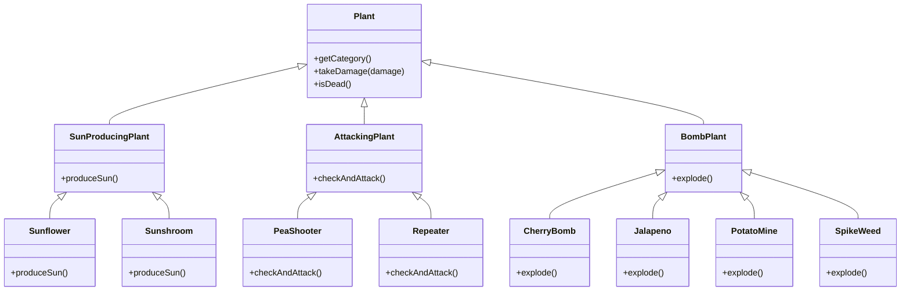
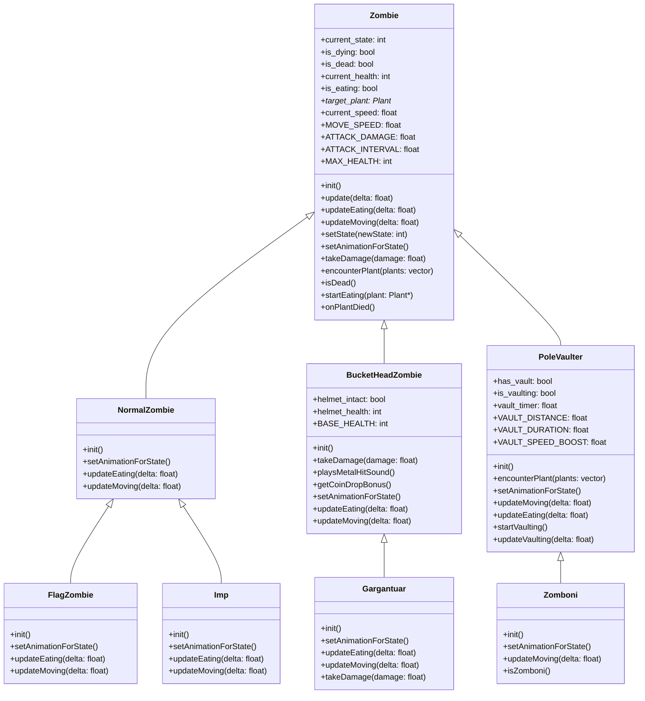
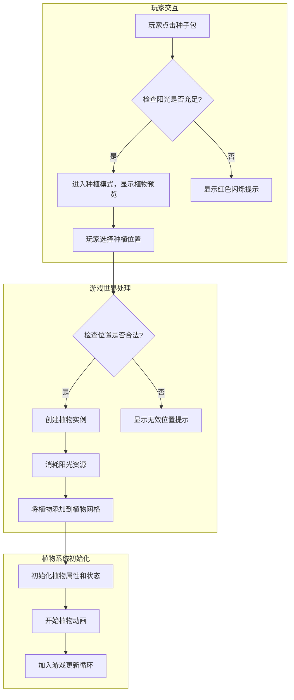
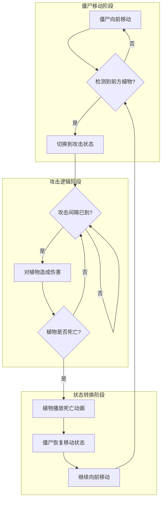
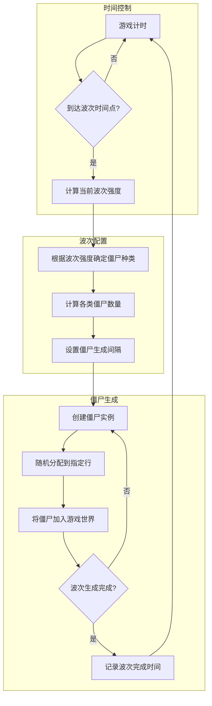

# 植物大战僵尸 - 系统架构设计文档
 > 版本: 1.0  
 > 最后更新: 2025年12月28日
## 📋 目录
 1. [项目概述](#项目概述)
 2. [架构总览](#架构总览)
 3. [核心组件设计](#核心组件设计)
 4. [接口设计](#接口设计)
 5. [角色类层次结构](#角色类层次结构)
 6. [系统交互流程](#系统交互流程)
 7. [实现状态与路线图](#实现状态与路线图)
## 项目概述
### 项目背景
本项目是基于Cocos2d-x游戏引擎开发的植物大战僵尸（Plants vs. Zombies）复刻版，旨在学习和实践2D游戏开发、面向对象设计和C++编程技术。游戏还原了经典塔防玩法，玩家通过种植不同功能的植物来抵御僵尸的入侵，同时需要管理阳光资源以维持防御体系。

### 开发环境
- **游戏引擎**：Cocos2d-x v3.17.2
- **开发语言**：C++
- **构建工具**：CMake
- **开发平台**：Windows 10/11 (Visual Studio 2019/2022)
- **资源管理**：Cocos2d-x AssetManager
- **版本控制**：Git

### 游戏类型
塔防类 (Tower Defense) / 策略类 (Strategy) / 2D休闲游戏

### 核心特性
- **植物防御系统**：支持14种功能各异的植物，包括攻击型、生产型、防御型等多种类型
- **僵尸波次系统**：动态生成6种僵尸类型，难度随波次递增
- **日夜交替模式**：白天/夜晚场景切换，影响阳光生成和植物生长
- **资源管理**：阳光和金币双资源系统，实现经济循环和策略深度

### 设计原则
- **组件化设计**：将游戏功能拆分为独立可复用组件，降低耦合度
- **面向对象**：充分利用继承、多态等OOP特性实现代码复用和扩展
- **数据驱动**：通过配置文件和枚举定义游戏参数和行为，便于平衡性调整
- **可扩展性**：设计灵活的接口和架构，方便添加新植物、僵尸和游戏模式
- **安全性**：采用Cocos2d-x的自动内存管理机制，避免内存泄漏

### 项目目标
- 实现经典植物大战僵尸游戏的核心玩法
- 展示面向对象设计和C++编程能力
- 构建可扩展的游戏架构，支持后续功能迭代
- 提供跨平台的游戏体验（当前主要支持Windows平台）
## 架构总览
### 高层架构图

```mermaid
graph TD
    subgraph core ["核心层(core)"]
        GameWorld[GameWorld 游戏世界控制器]
        AppDelegate[AppDelegate 应用入口]
        Background[Background 背景管理]
        GameDefs[GameDefs 游戏常量定义]
    end
    
    subgraph gameobjects ["游戏对象层(gameobjects)"]
        GameObject[GameObject 游戏对象基类]
        SeedPacket[SeedPacket 种子包]
        Sun[Sun 阳光]
        Coin[Coin 金币]
        Shovel[Shovel 铲子]
        SelectCard[SelectCard 选卡界面]
    end
    
    subgraph plants ["植物层(plants)"]
        Plant[Plant 植物基类]
        AttackingPlant[AttackingPlant 攻击植物]
        SunProducingPlant[SunProducingPlant 产阳光植物]
        PeaShooter[PeaShooter 豌豆射手]
        Repeater[Repeater 双发射手]
        Sunflower[Sunflower 向日葵]
        Sunshroom[Sunshroom 阳光菇]
    end
    
    subgraph zombies ["僵尸层(zombies)"]
        Zombie[Zombie 僵尸基类]
        NormalZombie[NormalZombie 普通僵尸]
        FlagZombie[FlagZombie 旗帜僵尸]
        BucketHeadZombie[BucketHeadZombie 铁桶僵尸]
        Gargantuar[Gargantuar 巨人僵尸]
    end
    
    subgraph bullets ["子弹层(bullets)"]
        Bullet[Bullet 子弹基类]
        Pea[Pea 豌豆子弹]
        Puff[Puff 烟雾子弹]
    end
    
    subgraph player ["玩家层(player)"]
        PlayerProfile[PlayerProfile 玩家档案]
    end
    
    subgraph scenes ["场景层(scenes)"]
        GameMenu[GameMenu 主菜单]
        SelectCardsScene[SelectCardsScene 选卡场景]
        ShopScene[ShopScene 商店场景]
    end
    
    %% 连线关系
    AppDelegate --> GameWorld
    GameWorld --> Background
    GameWorld --> GameObject
    
    GameObject --> Plant
    GameObject --> Zombie
    GameObject --> Bullet
    GameObject --> SeedPacket
    GameObject --> Sun
    GameObject --> Coin
    GameObject --> Shovel
    GameObject --> SelectCard
    
    Plant --> AttackingPlant
    Plant --> SunProducingPlant
    
    AttackingPlant --> PeaShooter
    AttackingPlant --> Repeater
    
    SunProducingPlant --> Sunflower
    SunProducingPlant --> Sunshroom
    
    Zombie --> NormalZombie
    NormalZombie --> FlagZombie
    NormalZombie --> BucketHeadZombie
    NormalZombie --> Gargantuar
    
    Bullet --> Pea
    Bullet --> Puff
    
    GameWorld --> PlayerProfile
    GameWorld --> GameMenu
    GameWorld --> SelectCardsScene
    GameWorld --> ShopScene
```


### 架构说明
本游戏采用基于Cocos2d-x的分层架构设计，严格按照项目实际目录结构组织代码：

1. **核心层(core)**：包含游戏的核心控制逻辑和应用入口
   - `AppDelegate`：应用程序入口点，负责初始化游戏引擎和场景切换
   - `GameWorld`：游戏世界的核心控制器，管理所有游戏元素和系统交互
   - `Background`：背景管理，负责游戏场景的视觉呈现
   - `GameDefs`：游戏常量定义，集中管理游戏中的各种数值和配置

2. **游戏对象层(gameobjects)**：包含所有游戏对象的基类和通用组件
   - `GameObject`：所有游戏对象的基类，提供统一的生命周期管理和更新机制
   - `SeedPacket`、`Sun`、`Coin`等：游戏中的各种道具和交互元素

3. **植物层(plants)**：植物相关的所有类，采用多层继承结构
   - `Plant`：所有植物的基类
   - `AttackingPlant`：攻击型植物的基类
   - `SunProducingPlant`：产阳光型植物的基类
   - 各种具体植物实现（如`PeaShooter`、`Repeater`、`Sunflower`、`Sunshroom`等）

4. **僵尸层(zombies)**：僵尸相关的所有类，采用继承结构实现不同类型僵尸
   - `Zombie`：所有僵尸的基类
   - `NormalZombie`：普通僵尸的基类
   - 各种具体僵尸实现（如`FlagZombie`、`BucketHeadZombie`、`Gargantuar`等）

5. **子弹层(bullets)**：子弹相关的所有类
   - `Bullet`：所有子弹的基类
   - 各种具体子弹实现（如`Pea`、`Puff`等）

6. **玩家层(player)**：玩家相关的类
   - `PlayerProfile`：玩家档案，管理玩家的阳光、金币等资源

7. **场景层(scenes)**：游戏中的各种场景
   - `GameMenu`：游戏主菜单
   - `SelectCardsScene`：选卡场景
   - `ShopScene`：商店场景

这种分层架构设计使得代码结构清晰，各模块职责明确，便于维护和扩展。游戏对象之间通过`GameWorld`进行协调，实现松耦合的系统交互。

## 核心组件设计

###  第一优先级 - 游戏核心组件

#### 1. GameWorld (已完成)
**职责**: 游戏世界的核心控制器，管理所有游戏元素、系统交互和游戏状态

**核心实现细节**:
- 采用单一场景模式，继承自Cocos2d-x的`Scene`类，负责游戏主循环和所有游戏元素的生命周期管理
- 使用二维数组`plant_grid[MAX_ROW][MAX_COL]`管理种植在网格上的植物，实现O(1)时间复杂度的位置查询
- 针对每行僵尸使用`std::vector<Zombie*> zombies_in_row[MAX_ROW]`进行分组管理，优化僵尸更新和碰撞检测效率
- 维护独立的子弹、阳光等动态对象列表，支持高效的创建和销毁操作

**关键方法实现**:
```cpp
class GameWorld : public cocos2d::Scene {
public:
    // 工厂方法，创建游戏场景实例
    static cocos2d::Scene* createScene(bool isNightMode = false, const std::vector<PlantName>& plantNames = std::vector<PlantName>());
    static GameWorld* create(bool isNightMode = false, const std::vector<PlantName>& plantNames = std::vector<PlantName>());
    
    // 初始化和清理
    virtual bool init() override;
    virtual ~GameWorld();
    
    // 组件管理方法
    void addZombie(Zombie* z);           // 添加僵尸到对应行
    void addIceTile(IceTile* ice);       // 添加冰路效果
    void removeIceInRow(int row);        // 移除整行冰路
    
    // 状态查询方法
    bool isNightMode() const { return is_night_mode; }
    int getSunCount() const { return sun_count; }
    
    // 游戏逻辑方法
    void showGameOver();                 // 显示游戏结束界面
    void showWinTrophy();                // 显示胜利界面
    
private:
    // 更新方法（核心游戏循环）
    virtual void update(float delta) override;
    void updateZombies(float delta);     // 更新所有僵尸状态
    void updatePlants(float delta);      // 更新所有植物状态
    void updateBullets(float delta);     // 更新所有子弹位置和碰撞
    void updateSuns(float delta);        // 更新阳光状态和收集
    
    // 波次生成系统
    void spawnTimedBatch(float normalizedTime); // 根据时间生成波次
    void spawnFinalWave();               // 生成最终波次
    void spawnSubBatch(int normalCnt, int poleCnt, int bucketHeadCnt, int zamboniCnt, int gargantuarCnt, float delaySec); // 生成子波次
    
    // 用户交互系统
    void setupUserInteraction();         // 设置用户交互事件
    bool tryPlantAtPosition(const cocos2d::Vec2& globalPos, SeedPacket* seedPacket); // 尝试在指定位置种植植物
    bool tryRemovePlantAtPosition(const cocos2d::Vec2& globalPos); // 尝试移除指定位置的植物
    
    // 资源和状态管理
    Plant* plant_grid[MAX_ROW][MAX_COL]; // 植物网格
    std::vector<Zombie*> zombies_in_row[MAX_ROW]; // 按行管理的僵尸
    std::vector<Bullet*> bullets;        // 所有子弹
    std::vector<Sun*> suns;              // 所有阳光
    std::vector<IceTile*> ice_tiles;     // 所有冰路
    
    int sun_count;                       // 当前阳光数量
    bool is_night_mode;                  // 是否为夜晚模式
    bool is_paused;                      // 游戏是否暂停
    float game_time;                     // 游戏运行时间
    float wave_spawn_timer;              // 波次生成计时器
    int current_wave;                    // 当前波次
};
```

**工作流程**:
1. **初始化阶段**：创建游戏世界、加载资源、设置场景布局、初始化植物网格和僵尸容器
2. **游戏循环**：通过`update`方法定期调用各系统的更新函数，处理所有游戏元素的状态变化
3. **用户交互**：监听触摸事件，处理植物种植、阳光收集等用户操作
4. **波次生成**：根据游戏时间和难度，动态生成不同种类和数量的僵尸
5. **碰撞检测**：在更新子弹时，检测与僵尸的碰撞并处理伤害逻辑
6. **状态管理**：维护游戏状态（白天/夜晚、暂停/运行），并在游戏结束时显示相应界面

#### 2. GameObject (已完成 ✅)
**职责**: 所有游戏对象的抽象基类，提供通用功能和统一的接口，包括动画系统、内存管理和基础属性设置

**核心设计理念**:
- 继承自Cocos2d-x的`Sprite`类，获得2D渲染和精灵管理能力
- 为所有游戏对象提供统一的生命周期管理
- 封装动画系统，简化不同对象的动画实现
- 支持Cocos2d-x的内存自动管理机制

**动画系统实现**:
```cpp
class GameObject : public cocos2d::Sprite {
public:
    virtual ~GameObject();
    virtual bool init() override;
    
protected:
    // 初始化循环动画（用于循环播放的动画，如行走、攻击）
    cocos2d::Animation* initAnimateForCycle(const std::string& fileName, float frameWidth, float frameHeight,
        int row, int col, int startIndex, int totalFrameCount, float delay);
    
    // 初始化序列动画（用于一次性播放的动画，如死亡、爆炸）
    cocos2d::Animation* initAnimate(const std::string& fileName, float frameWidth, float frameHeight,
        int row, int col, int startIndex, int endIndex, float delay);
    
    // 播放动画的通用方法
    void playAnimation(cocos2d::Animation* animation, bool loop = false);
    
    // 构造函数（保护，防止直接实例化）
    GameObject();
};
```

**动画系统工作原理**:
1. **帧序列加载**：通过`initAnimateForCycle`或`initAnimate`方法加载精灵帧序列
2. **动画创建**：将帧序列组合成`Animation`对象，并设置播放延迟
3. **动作包装**：将`Animation`包装成`Animate`动作，支持循环播放
4. **动画播放**：通过`playAnimation`方法播放动画，并管理动画的切换和停止

**内存管理机制**:
- 所有GameObject的子类都遵循Cocos2d-x的内存管理规则
- 使用`autorelease()`方法创建对象，将其加入自动释放池
- 在适当的时机（如对象死亡或不再需要时）调用`removeFromParent()`或由主场景调用`removeChild()`方法
- 避免手动内存管理，减少内存泄漏风险

**与其他组件的交互**:
- 作为所有游戏实体的基类，被Plant、Zombie、Bullet等类继承
- 通过Sprite继承获得渲染能力，被GameWorld管理和渲染
- 动画系统被所有游戏对象共享，确保一致的动画表现
- 碰撞系统通过系统自带的碰撞检测机制实现对象间的碰撞检测

### 🟡 第二优先级 - 战斗与防御系统

#### 1. Plant (已完成 ✅)
**职责**: 所有植物的抽象基类，定义植物的基本属性、行为和生命周期管理

**核心设计特点**:
- 使用模板方法`createPlantAtPosition<T>`实现类型安全的植物创建
- 定义纯虚函数`getCategory()`实现多态，区分不同类型的植物
- 封装健康系统、冷却系统和位置管理
- 支持Cocos2d-x的自动内存管理机制

**详细实现**:
```cpp
class Plant : public GameObject {
public:
    virtual ~Plant();
    virtual bool init() override;
    virtual void update(float delta) override;
    
    // 纯虚函数，获取植物类别（攻击型、生产型、防御型等）
    virtual PlantCategory getCategory() const = 0;
    
    // 状态查询方法
    bool isDead() const;
    virtual bool isSpike() const { return false; }      // 是否为地刺类植物
    virtual bool canBeUpgradedTo(PlantName upgradePlantName) const { return false; } // 是否可以升级
    
    // 交互方法
    void takeDamage(float damage);                      // 承受伤害
    
protected:
    // 构造函数（保护，防止直接实例化）
    Plant();
    
    // 位置设置方法
    void setPlantPosition(const cocos2d::Vec2& pos);
    
    // 模板工厂方法，用于创建特定类型的植物实例（类型安全）
    template<typename T>
    static T* createPlantAtPosition(const cocos2d::Vec2& globalPos, int dx = 30, int dy = 8);
    
    // 初始化植物属性
    bool initPlantWithSettings(const std::string& imageFile,
                               const cocos2d::Rect& initialRect,
                               int maxHealth,
                               float cooldown);
    
    // 动画设置方法（子类重写以实现特定动画）
    virtual void setAnimation();
    
    // 静态常量
    static const float ATTACK_RANGE;      // 植物攻击范围（默认为3格）
    static const float PLANT_CELL_SIZE;   // 植物占用的网格大小
    
    // 核心属性
    bool is_dead;                         // 是否死亡
    int max_health;                       // 最大生命值
    int current_health;                   // 当前生命值
    float cooldown_interval;              // 冷却时间间隔
    float accumulated_time;               // 累积时间（用于冷却计算）
    cocos2d::Vec2 plant_pos;              // 植物在网格中的位置
};
```

**模板方法的使用**:
```cpp
// 模板方法实现示例
    template<typename T>
    static T* createPlantAtPosition(const cocos2d::Vec2& globalPos, int dx = 30, int dy = 8)
    {
        int col = static_cast<int>((globalPos.x - GRID_ORIGIN.x) / CELLSIZE.width);
        int row = static_cast<int>((globalPos.y - GRID_ORIGIN.y) / CELLSIZE.height);

        if (col < 0 || col >= MAX_COL || row < 0 || row >= MAX_ROW) {
            return nullptr;
        }

        float centerX = GRID_ORIGIN.x + col * CELLSIZE.width + CELLSIZE.width * 0.5f;
        float centerY = GRID_ORIGIN.y + row * CELLSIZE.height + CELLSIZE.height * 0.5f;

        cocos2d::Vec2 plantPos(centerX + static_cast<float>(dx), centerY + static_cast<float>(dy));

        auto plant = T::create();
        if (plant)
        {
            plant->setPlantPosition(plantPos);
        }

        return plant;
    }

```

**内存管理机制**:
- 使用Cocos2d-x的`autorelease()`方法管理植物对象的生命周期
- 模板方法`createPlantAtPosition<T>`自动将创建的植物添加到自动释放池
- 当植物死亡时，通过`removeFromParent()`方法从场景中移除并释放资源
- 避免手动内存管理，减少内存泄漏风险

**与其他组件的交互**:
- 被GameWorld的植物网格管理和更新
- 通过getCategory()方法实现多态，区分不同类型的植物
- 与僵尸系统交互，实现攻击、防御等行为
- 通过Bullet系统实现远程攻击能力

#### 2. Zombie (已完成 ✅)
**职责**: 所有僵尸的抽象基类，定义僵尸的基本属性和行为

```cpp
class Zombie : public GameObject {
public:
    virtual bool init() = 0;
    virtual void update(float delta);
    virtual void updateEating(float delta);
    virtual void updateMoving(float delta);
    
    void setState(int newState);
    virtual void setAnimationForState() = 0;
    virtual void takeDamage(float damage);
    virtual void encounterPlant(const std::vector<Plant*>& plants);
    
    inline bool isDead() const { return is_dead && !is_dying; }
    virtual void startEating(Plant* plant);
    virtual void onPlantDied();
    
    virtual float getCoinDropBonus() const { return 1.0f; }
    virtual bool playsMetalHitSound() const { return false; }
    virtual bool isZomboni() const { return false; }
    virtual bool hasBeenAttackedBySpike() const { return false; }
    virtual void setSpecialDeath() { /* Default implementation does nothing */ }
    
protected:
    int current_state = 1;
    bool is_dying = false;
    bool is_dead = false;
    int current_health = 200;
    float accumulated_time = 0.0f;
    bool is_eating = false;
    Plant* target_plant = nullptr;
    float current_speed = 20.0f;
    float MOVE_SPEED = 20.0f;
    float ATTACK_DAMAGE = 10.0f;
    float ATTACK_INTERVAL = 0.5f;
    int MAX_HEALTH = 200;
    float X_CORRECTION = 40.0f;
    float SIZE_CORRECTION = 100.0f;
};
```

#### 3. 具体植物实现方法

##### 3.1 Sunflower (向日葵) (已完成 ✅)
**职责**: 阳光生产型植物，定期产生阳光资源，是游戏经济系统的基础

**核心实现细节**:
- 继承自`SunProducingPlant`类
- 采用冷却时间机制，每12秒产生一个阳光
- 使用模板方法`createPlantAtPosition`实现植物的网格定位
- 阳光生成位置固定在向日葵上方


##### 3.2 PeaShooter (豌豆射手) (已完成 ✅)
**职责**: 基础攻击型植物，发射豌豆子弹攻击前方僵尸，是游戏防御系统的核心

**核心实现细节**:
- 继承自`AttackingPlant`接口
- 采用范围检测算法，检测前方是否有僵尸
- 使用模板方法创建特定类型的子弹
- 实现攻击冷却机制，确保攻击频率可控


##### 3.3 CherryBomb (樱桃炸弹) (已完成 ✅)
**职责**: 爆炸型植物，在一定范围内对所有僵尸造成大量伤害，用于应对僵尸密集情况

**核心实现细节**:
- 继承自`BombPlant`基类，实现爆炸型植物的特殊行为
- 使用延迟触发机制，种植后自动进行武装动画，完成后爆炸
- 采用范围检测算法，计算爆炸范围内的所有僵尸
- 实现3x3网格的范围伤害效果


##### 3.4 Sunshroom (阳光菇) (已完成 ✅)
**职责**: 昼夜适应型阳光生产植物，根据环境条件调整阳光产出效率，是游戏中白天和夜晚模式切换时的关键资源生产者

**核心实现细节**:
Sunshroom是一个典型的状态机驱动植物，它通过状态变化实现了从幼年到成熟的成长过程，以及昼夜环境下的产出效率调整。

**成长机制实现**:
- 继承自`SunProducingPlant`和`Mushroom`接口，实现双重继承以获得阳光生产能力和蘑菇的昼夜特性
- 包含`growth_state`和`growth_timer`状态变量，用于跟踪成长进度和当前状态
- 在`update`方法中持续累积成长时间，当达到阈值时触发`startGrowingSequence()`方法实现状态转换
- 成长后不仅阳光产出量增加（幼年15阳光→成熟25阳光），植物的视觉表现也会相应变化


**环境适应能力**:
- 通过`GameWorld`获取当前场景的昼夜状态（`isNightMode()`方法）
- 根据环境切换不同的阳光生产间隔（白天10秒/次→夜晚8秒/次）
- 使用条件编译和常量定义，确保不同环境下的参数可配置、易维护

**状态机管理**:
- 实现了"幼年状态"和"成熟状态"两种核心状态，通过布尔变量`is_mature`进行切换
- 每种状态下的阳光产出量、生产间隔和视觉表现都有所不同
- 状态转换时会更新植物的精灵动画，提供直观的成长反馈

**关键代码实现**:
```cpp
class Sunshroom : public Plant, public SunProducingPlant {
public:
    static Sunshroom* create();
    virtual bool init() override;
    virtual void update(float delta) override;
    
    // 实现阳光生产接口
    virtual std::vector<Sun*> produceSun() override;
    
    // 实现植物类别接口
    virtual PlantCategory getCategory() const override { return PlantCategory::SUN_PRODUCING; }
    
protected:
    Sunshroom();
    virtual ~Sunshroom();
    
    // 设置动画
    virtual void setAnimation() override;
    
    // 成长相关方法
    void growUp();
    
    // 阳光生产相关属性
    float sun_produce_timer = 0.0f;
    float grow_timer = 0.0f;
    bool is_mature = false;
    
    // 不同环境下的阳光生产间隔
    static const float SUN_PRODUCE_INTERVAL_DAY; // 10.0f秒（白天）
    static const float SUN_PRODUCE_INTERVAL_NIGHT; // 8.0f秒（夜晚）
    
    // 不同生长阶段的阳光值
    static const int SUN_VALUE_JUVENILE; // 15阳光（幼年）
    static const int SUN_VALUE_MATURE; // 25阳光（成熟）
    
    // 成长时间
    static const float GROW_TIME; // 30.0f秒
};

// 阳光生产实现
typedef std::vector<Sun*> SunVector;
SunVector Sunshroom::produceSun() {
    SunVector producedSuns;
    
    // 创建阳光实例
    Sun* sun = Sun::create();
    if (sun) {
        // 设置阳光位置为阳光菇上方随机偏移
        cocos2d::Vec2 sunPos = getPosition();
        sunPos.y += 40.0f;
        sunPos.x += (rand() % 30) - 15; // 随机偏移-15到15像素
        sun->setPosition(sunPos);
        
        // 根据生长阶段设置阳光值
        sun->setValue(is_mature ? SUN_VALUE_MATURE : SUN_VALUE_JUVENILE);
        
        // 添加到列表
        producedSuns.push_back(sun);
    }
    
    return producedSuns;
}

// 更新逻辑实现
void Sunshroom::update(float delta) {
    Plant::update(delta);
    
    // 处理成长机制
    if (!is_mature) {
        grow_timer += delta;
        if (grow_timer >= GROW_TIME) {
            growUp();
        }
    }
    
    // 根据昼夜模式设置不同的阳光生产间隔
    GameWorld* gameWorld = dynamic_cast<GameWorld*>(getParent());
    float sunProduceInterval = gameWorld && gameWorld->isNightMode() ? 
        SUN_PRODUCE_INTERVAL_NIGHT : SUN_PRODUCE_INTERVAL_DAY;
    
    // 阳光生产计时
    sun_produce_timer += delta;
    if (sun_produce_timer >= sunProduceInterval) {
        sun_produce_timer = 0.0f;
        
        // 生产阳光
        auto suns = produceSun();
        for (auto sun : suns) {
            if (sun) {
                getParent()->addChild(sun);
            }
        }
    }
}

// 成长实现
void Sunshroom::growUp() {
    is_mature = true;
    
    // 播放成长动画
    playAnimation(growAnimation);
    
    // 调整植物大小
    setScale(1.2f);
    
    // 更新碰撞盒
    updateCollisionBox();
}
```

##### 3.5 Repeater (双重射手) (已完成 ✅)
**职责**: 高级攻击型植物，能够快速连续发射两颗豌豆，提供更强的火力输出，是基础豌豆射手的增强版

**核心实现细节**:
Repeater是一个典型的继承扩展案例，它通过继承PeaShooter类，在不修改父类代码的情况下扩展了双发射击功能，充分体现了面向对象设计中的开闭原则。

**继承关系与扩展设计**:
- 直接继承自`PeaShooter`类，复用了父类的所有功能，包括攻击冷却机制、范围检测算法和子弹创建逻辑
- 仅重写`checkAndAttack`方法，在保持原有攻击逻辑不变的基础上增加双发射击功能
- 使用C++的多态特性，确保在GameWorld中可以与其他攻击型植物统一处理

**双发射击机制实现**:
- 保持与基础豌豆射手相同的攻击冷却时间，确保游戏平衡性
- 在单次攻击中创建并发射两颗豌豆子弹，第二颗子弹延迟发射，形成连续射击效果
- 使用模板方法创建特定类型的子弹，确保与父类的子弹创建逻辑一致
- 通过`std::vector<Bullet*>`返回所有创建的子弹，便于GameWorld统一管理和添加到场景中

#### 4. 具体僵尸实现方法

##### 4.1 NormalZombie (普通僵尸) (已完成 ✅)
**职责**: 基础僵尸单位，移动速度和生命值平衡，是游戏中最常见的敌人

**核心实现细节**:
- 继承自`Zombie`基类，实现基础僵尸行为
- 采用状态机管理移动、进食和死亡状态
- 使用动画系统实现流畅的状态切换
- 实现基础的攻击机制，每0.5秒对植物造成10点伤害


##### 4.2 BucketHeadZombie (铁桶僵尸) (已完成 ✅)
**职责**: 防御型僵尸，头部带有铁桶，提供额外防护，增加游戏难度

**核心实现细节**:
- 继承自`Zombie`基类，重写部分行为
- 生命值提升至普通僵尸的2.5倍（500点）
- 添加金属碰撞音效，增强游戏反馈
- 实现头盔掉落机制，头盔被破坏后变为普通僵尸


##### 4.3 PoleVaulter (撑杆僵尸) (已完成 ✅)
**职责**: 特殊移动僵尸，使用撑杆跳过第一株植物，增加游戏策略性

**核心实现细节**:
- 继承自`Zombie`基类，扩展跳跃行为
- 采用状态机管理跳跃流程，包括助跑、跳跃和落地
- 实现碰撞检测，检测前方植物触发跳跃
- 跳跃后失去撑杆，变为普通移动状态


##### 4.4 FlagZombie (旗帜僵尸) (已完成 ✅)
**职责**: 波次先锋僵尸，携带旗帜标识新一波僵尸的开始，移动速度略快于普通僵尸，是游戏波次系统的视觉指示器

**核心实现细节**:
FlagZombie是一个典型的装饰模式应用案例，它在不修改NormalZombie核心功能的基础上，通过继承和扩展添加了旗帜展示和特殊移动特性，成为了波次系统的重要组成部分。

**波次指示器设计**:
- 继承自`NormalZombie`类，完全复用普通僵尸的所有核心功能
- 在游戏设计中，旗帜僵尸总是作为每一波僵尸的第一个出现，通过视觉反馈告诉玩家新的挑战即将开始

**特殊移动特性**:
- 实现了`MOVEMENT_SPEED_BONUS`常量（1.1倍速），使旗帜僵尸比普通僵尸快10%
- 重写`updateMoving()`方法，在保持原有移动逻辑不变的基础上，增加速度加成
- 这种速度差异不仅增加了游戏的紧迫感，也让旗帜僵尸更容易被玩家识别

**旗帜动画系统**:
- 独立的旗帜精灵组件`flag`，与僵尸主体分离，便于单独控制动画
- 实现了`flag_swing_timer`计时器和`FLAG_SWING_SPEED`常量（2秒/周期）
- 在`updateMoving()`方法中通过正弦函数计算旗帜的摆动角度，实现自然流畅的摆动效果
- 旗帜的视觉设计与当前波次主题相匹配，增强了游戏的视觉表现力

**设计意图与用户体验**:
- 作为波次开始的明确信号，减少玩家的困惑，提升游戏的可预测性
- 通过速度差异和特殊视觉标识，使旗帜僵尸在群体中脱颖而出，便于玩家优先处理
- 额外的金币奖励机制，鼓励玩家积极应对新一波僵尸的到来


##### 4.5 Gargantuar (巨人僵尸) (已完成 ✅)
**职责**: 巨型强力僵尸，生命值高、伤害大，是游戏中最具威胁的敌人之一，作为游戏的"精英怪"角色，提供高挑战性的游戏体验

**设计理念与定位**:
Gargantuar作为游戏中的终极威胁之一，其设计遵循了"高风险高回报"的原则，通过强大的能力和独特的机制，为玩家提供了极具挑战性的游戏体验。

**核心属性与平衡性设计**:
- 继承自`Zombie`基类，但拥有远超出普通僵尸的基础属性
- 生命值高达3000点，是普通僵尸的10倍以上，需要玩家投入大量火力
- 移动速度较慢（约普通僵尸的70%），给予玩家反应和准备时间
- 攻击间隔较长（2秒），但单次伤害极高（150点），可直接摧毁大多数植物

**多层次攻击机制**:

**普通攻击系统**:
- 重写`updateEating()`方法，实现每2秒造成150点伤害的强力攻击
- 攻击动画与伤害计算分离，确保视觉反馈与游戏逻辑的一致性
- 可直接摧毁植物（包括坚果墙等防御型植物），需要玩家采用特殊策略应对

**砸地攻击机制**:
- 独立的`performGroundSlam()`方法实现范围攻击逻辑
- 通过`ground_slam_timer`和`ground_slam_cooldown`管理攻击周期
- 3x3范围伤害（120像素半径），对范围内所有植物造成150点伤害
- 攻击前有明显的动画提示，给予玩家规避和防御的机会
- 冷却时间长达15秒，确保攻击的稀缺性和战略性

**死亡机制与小鬼僵尸系统**:
- 重写`onDeath()`方法，实现死亡时抛出小鬼僵尸的独特机制
- `throwImp()`方法负责创建和初始化小鬼僵尸
- 小鬼僵尸具有较高的移动速度和攻击能力，延续了Gargantuar的威胁
- 这种"死后继续战斗"的机制增加了Gargantuar的战术价值和挑战性

**状态管理与视觉反馈**:
- 实现了完整的状态机，包括移动、进食、砸地攻击和死亡状态
- 不同状态对应不同的动画效果，提供清晰的视觉反馈
- 受伤时的特殊动画和音效，让玩家能够直观地了解Gargantuar的状态
- 体积巨大（约普通僵尸的2.5倍），在群体中极具辨识度

**战略意义与游戏体验**:
- 作为游戏中的" boss 级"敌人，通常在波次末尾出现，考验玩家的资源积累和防御策略
- 迫使玩家采用多种防御手段（如冰冻、减速、群体攻击等）的组合
- 其出现会改变游戏节奏，增加紧张感和刺激感
- 提供极高的击杀奖励，包括大量阳光和金币


## C++特性使用详解

### 1. 模板方法模式 (Template Method Pattern)

本项目大量使用C++模板特性实现类型安全的工厂方法，最典型的应用是`Plant::createPlantAtPosition<T>`模板方法。

**核心实现与优势**:
```cpp
template<typename T>
static T* createPlantAtPosition(const cocos2d::Vec2& globalPos, int dx = 30, int dy = 8);
```

- **类型安全**：确保创建的植物对象类型与预期一致，避免运行时类型转换错误
- **代码复用**：将植物创建的通用逻辑（位置计算、网格检查、Z轴设置等）集中在模板方法中
- **扩展性**：支持创建任何Plant子类的实例，无需为每种植物编写重复的创建代码
- **内存安全**：自动调用`autorelease()`方法，确保对象被正确添加到自动释放池

**使用示例**:
```cpp
// 创建豌豆射手
PeaShooter* peaShooter = Plant::createPlantAtPosition<PeaShooter>(touchPos);
if (peaShooter) {
    // 添加到游戏世界
    gameWorld->addPlant(peaShooter, row, col);
}

// 创建向日葵
Sunflower* sunflower = Plant::createPlantAtPosition<Sunflower>(touchPos, 20, 10);
if (sunflower) {
    // 添加到游戏世界
    gameWorld->addPlant(sunflower, row, col);
}
```

### 2. SeedPacket工厂模式与配置表

`SeedPacket`类是本项目中工厂模式和数据驱动设计的典型代表，通过静态配置表和工厂函数实现了植物的动态创建和集中管理。

#### 2.1 核心设计架构

**配置表与工厂函数结合**:
```cpp
class SeedPacket : public cocos2d::Sprite {
public:
    // 配置表类型定义 - 工厂函数类型，返回Plant指针
    typedef std::function<Plant*()> PlantFactory;
    
    // 植物配置结构体，包含植物的所有静态属性
    struct PlantConfig {
        PlantName name;          // 植物名称枚举
        int cost;                // 阳光成本
        float rechargeTime;      // 冷却时间（秒）
        PlantFactory factory;    // 工厂函数，用于创建植物实例
        std::string spriteFile;  // 种子包图片路径
    };
    
    // 静态配置表 - 所有植物的配置信息集中存储
    static const std::unordered_map<PlantName, PlantConfig> CONFIG_TABLE;
    
    // 种子包创建方法
    static SeedPacket* create(PlantName plantName);
    
    // 获取当前种子包对应的植物配置
    const PlantConfig& getPlantConfig() const { return config; }
    
    // 使用工厂函数创建对应植物实例
    Plant* createPlant() const { return config.factory(); }
    
private:
    PlantConfig config;        // 当前种子包对应的植物配置
    float rechargeTimer = 0.0f; // 冷却计时器
    bool isReady = true;       // 种子包是否就绪
};
```

#### 2.2 配置表初始化与使用

**配置表初始化**:
```cpp
const std::unordered_map<PlantName, SeedPacket::PlantConfig> SeedPacket::CONFIG_TABLE = {
    {
        PlantName::SUNFLOWER,
        {
            PlantName::SUNFLOWER,
            50,                           // 50阳光
            7.5f,                         // 7.5秒冷却
            []() -> Plant* { return Sunflower::create(); }, // 工厂lambda
            "sunflower_seed.png"          // 种子包图片
        }
    },
    {
        PlantName::PEASHOOTER,
        {
            PlantName::PEASHOOTER,
            100,                          // 100阳光
            7.5f,                         // 7.5秒冷却
            []() -> Plant* { return PeaShooter::create(); }, // 工厂lambda
            "peashooter_seed.png"         // 种子包图片
        }
    },
    {
        PlantName::CHERRY_BOMB,
        {
            PlantName::CHERRY_BOMB,
            150,                          // 150阳光
            30.0f,                        // 30秒冷却
            []() -> Plant* { return CherryBomb::create(); }, // 工厂lambda
            "cherry_bomb_seed.png"        // 种子包图片
        }
    },
    // 更多植物配置...
};
```


#### 2.3 技术优势与设计思想

**1. 集中化配置管理**
- 将所有植物的属性（阳光成本、冷却时间、工厂方法等）集中存储在一个配置表中
- 便于游戏平衡性调整，只需修改配置表中的数值即可，无需修改核心代码
- 提供了统一的配置接口，降低了代码的耦合度

**2. 工厂模式的灵活应用**
- 使用C++11的lambda表达式作为工厂函数，实现了简洁高效的植物创建
- 工厂函数封装了植物创建的细节，包括初始化、内存管理等
- 支持任何Plant子类的创建，只要提供对应的工厂函数即可

**3. 类型安全与枚举使用**
- 使用`PlantName`枚举类型作为配置表的键，避免了字符串类型的错误
- 编译器可以检查枚举类型的合法性，提高了代码的可靠性
- 便于代码自动补全和重构，提升开发效率

**4. 数据驱动设计**
- 植物的行为和属性主要由配置数据驱动，而不是硬编码
- 支持运行时加载配置文件，实现游戏内容的动态更新
- 便于测试和调试，可以快速切换不同的配置组合

**5. 封装与接口设计**
- `SeedPacket`类封装了种子包的所有功能，包括冷却管理、植物创建等
- 提供了简洁统一的接口，如`createPlant()`、`isReady()`等
- 隐藏了植物创建的复杂细节，降低了使用难度

#### 2.4 扩展性与维护性

`SeedPacket`的设计使得添加新植物变得非常简单，只需三个步骤：

1. **创建植物类**：继承自`Plant`基类，实现相应的功能
2. **添加配置记录**：在`CONFIG_TABLE`中添加一条新的配置记录，包含植物的所有属性和工厂函数
3. **初始化种子包**：在游戏初始化阶段创建对应的种子包实例

这种设计完全符合"开闭原则"，对扩展开放，对修改关闭，极大地提高了代码的可维护性和扩展性。

#### 2.5 与其他系统的交互

`SeedPacket`系统与游戏的其他模块紧密协作：

- **UI系统**：种子包的显示、点击事件处理、冷却状态更新
- **资源系统**：根据配置表中的图片路径加载种子包资源
- **游戏世界**：植物实例的创建、位置设置和生命周期管理
- **资源管理**：阳光的消耗和冷却时间的管理

通过这种模块化的设计，各系统之间保持了良好的独立性和协作性，便于单独维护和扩展。

### 3. 静态常量与类常量

项目中广泛使用静态常量和类常量，提高代码的可读性和可维护性。

**核心应用**:
- **植物属性**：攻击范围、阳光生产间隔、爆炸范围等
- **僵尸属性**：移动速度、攻击伤害、生命值等
- **游戏常量**：网格大小、游戏区域边界、波次时间等

**使用示例**:
```cpp
// 植物类中的静态常量
class Plant : public GameObject {
protected:
    static const float ATTACK_RANGE;      // 植物攻击范围（默认为3格）
    static const float PLANT_CELL_SIZE;   // 植物占用的网格大小
};

// 向日葵类中的静态常量
class Sunflower : public Plant, public SunProducingPlant {
protected:
    static const float SUN_PRODUCE_INTERVAL; // 8.0f秒
    static const int SUN_VALUE; // 25阳光
};
```

**技术优势**:
- **可读性**：常量名称清晰表达其含义，提高代码可读性
- **可维护性**：集中管理常量值，便于统一修改和调整游戏平衡性
- **编译时检查**：编译器可以检查常量使用的合法性
- **避免魔法数字**：减少代码中的硬编码数字，提高代码质量

### 4. 内存管理

项目充分利用Cocos2d-x的自动内存管理机制，确保内存安全。


**安全性优势**:
- **避免内存泄漏**：Cocos2d-x的自动释放池会在每一帧结束时自动释放不再使用的对象
- **防止空指针**：`CC_SAFE_DELETE`和`nullptr`检查确保安全的内存操作
- **异常安全**：智能指针在异常情况下自动释放资源
- **简化代码**：减少手动内存管理的代码量，降低出错风险

### 5. 多态与虚函数

项目广泛使用C++的多态特性，通过虚函数实现不同植物和僵尸的差异化行为。

**核心应用**:
```cpp
// 植物类别多态
virtual PlantCategory getCategory() const = 0;

// 攻击行为多态
virtual std::vector<Bullet*> checkAndAttack(std::vector<Zombie*> allZombiesInRow[MAX_ROW], int plantRow) = 0;

// 阳光生产多态
virtual std::vector<Sun*> produceSun() = 0;

// 僵尸状态动画多态
virtual void setAnimationForState() = 0;
```

**技术优势**:
- **行为差异化**：不同植物/僵尸可以实现不同的攻击、移动、生产等行为
- **接口统一**：通过统一的接口调用不同对象的方法，无需关心具体类型
- **扩展性**：添加新植物/僵尸只需实现相应的虚函数，无需修改现有代码
- **代码复用**：通用行为在基类实现，特殊行为在子类重写

### 6. STL容器与算法

项目大量使用STL容器和算法，提高代码效率和可读性。

**核心应用**:
```cpp
// 植物网格管理
Plant* plant_grid[MAX_ROW][MAX_COL];

// 僵尸按行管理
std::vector<Zombie*> zombies_in_row[MAX_ROW];

// 动态对象管理
std::vector<Bullet*> bullets;
std::vector<Sun*> suns;
std::vector<IceTile*> ice_tiles;

// 配置表管理
std::unordered_map<PlantName, SeedPacket::PlantConfig> CONFIG_TABLE;


```

**技术优势**:
- **高效管理**：不同类型的容器适应不同的应用场景，提供高效的数据访问和操作
- **代码简洁**：使用STL容器和算法使代码更加简洁易读
- **性能优化**：STL容器经过高度优化，提供优秀的性能

## 安全性设计与实践

本项目在安全性设计方面采取了多层次、全方位的策略，结合Cocos2d-x框架的特性和C++语言的安全机制，确保游戏的稳定性、可靠性和安全性。

### 1. 自动内存管理 (`autorelease`)

本项目严格遵循Cocos2d-x的自动内存管理机制，所有游戏对象都通过`autorelease()`方法创建和管理，避免了手动内存管理带来的风险。


**安全性优势**:
- **避免内存泄漏**：对象在不再使用时自动释放，无需手动管理
- **简化代码**：减少手动内存管理的代码量，降低出错风险
- **提高稳定性**：减少内存相关的崩溃和异常
- **异常安全**：使用`std::nothrow`避免内存分配失败时抛出异常

### 2. 空指针检查

项目中对所有可能的空指针进行严格检查，确保程序的稳定性和可靠性。

**核心实践**:
```cpp
// 检查植物指针
if (plant != nullptr && plant->isDead())
{
    this->removeChild(plant);
    plant_grid[row][col] = nullptr;
}

// 检查僵尸指针
if (zombie && zombie->isDead())
{
    spawnCoinAfterZombieDeath(zombie);
    Zombie* deadZombie = zombie;
    it = zombiesInThisRow.erase(it);
    if (deadZombie && deadZombie->getParent() == this)
    {
        // removeChild will handle cleanup and release
        this->removeChild(deadZombie, true); // true = cleanup
    }
}

```

**安全性优势**:
- **防止崩溃**：避免因空指针解引用导致的程序崩溃
- **提高稳定性**：确保程序在对象不存在时仍能正常运行
- **便于调试**：通过空指针检查可以快速定位问题
- **资源安全**：确保资源在使用前已正确初始化

### 3. 类型安全转换

项目使用C++的`dynamic_cast`进行安全的类型转换，避免类型转换错误导致的崩溃。

**核心实践**:
```cpp
switch (category)
{
    case PlantCategory::SUN_PRODUCING:
    {
        // Sun-producing plants (e.g., Sunflower)
        SunProducingPlant* sunPlant = dynamic_cast<SunProducingPlant*>(plant);
        for (auto& sun : sunPlant->produceSun()) {
            if (sun)
            {
                this->addChild(sun, SUN_LAYER);
                suns.push_back(sun);
                CCLOG("Sun-producing plant produced sun at position (%.2f, %.2f)",
                    sun->getPositionX(), sun->getPositionY());
            }
        }
        break;
    }

    case PlantCategory::ATTACKING:
    {
        // Attacking plants (e.g., PeaShooter, Repeater, ThreePeater, Wallnut)
        // Pass all zombies to plant, let plant decide which rows to check
        AttackingPlant* attackPlant = dynamic_cast<AttackingPlant*>(plant);

        std::vector<Bullet*> newBullets = attackPlant->checkAndAttack(zombies_in_row, row);

        // Add all created bullets to scene and container
        for (Bullet* bullet : newBullets)
        {
            if (bullet)
            {
                this->addChild(bullet, BULLET_LAYER);
                bullets.push_back(bullet);
            }
        }
        break;
    }

    case PlantCategory::BOMB:
    {
        // Bomb plants (e.g., CherryBomb)
        BombPlant* bombPlant = dynamic_cast<BombPlant*>(plant);
        bombPlant->explode(zombies_in_row, row, col);
        break;
    }
```

**安全性优势**:
- **类型安全**：只有在类型转换合法时才返回非空指针
- **避免崩溃**：防止因类型转换错误导致的程序崩溃
- **提高可读性**：明确表达类型转换的意图
- **动态适配**：支持运行时类型检查，提高代码的灵活性

### 4. 异常处理与资源加载安全

在 `GameWorld` 的实现中，为了保证游戏在资源缺失或逻辑异常时不会直接闪退（Crash），项目采用了一套结合“防御性编程”与“即时错误反馈”的机制。

#### 4.1 资源加载的“软着陆” (problemLoading)

项目定义了静态辅助函数 `problemLoading`，专门用于捕获资源加载失败。

* **逻辑原理**：在加载 `Sprite` 或 `BackGround` 后，立即进行 `nullptr` 判空。
* **反馈机制**：通过控制台输出具体的错误文件名及路径建议，而非让程序在后续调用 `addChild` 时因尝试访问空指针而崩溃。

```cpp
static void problemLoading(const char* filename) {
    printf("Error while loading: %s\n", filename);
    // 提示开发者检查编译后的路径配置（Resources/ 目录）
}

```

#### 4.2 场景创建的安全保障 (Safe Instance Creation)

在 `GameWorld::create` 中，使用了 `std::nothrow` 和多级逻辑验证：

1. **内存申请安全**：使用 `new (std::nothrow)` 申请内存，若内存溢出则返回 `nullptr`。
2. **两步初始化**：在 `instance->init()` 执行后才将其加入 `autorelease` 池。如果初始化中途任何环节（如背景加载、SeedPacket 初始化）失败，会立即手动执行 `delete`，确保没有内存残留。

#### 4.3 动态交互中的状态验证

在 `setupUserInteraction`（用户交互配置）中，异常处理主要体现在对非法操作的拦截：

* **阳光/金币收集**：在 `onTouchBegan` 中，首先通过 `sun->isCollectible()` 验证对象状态，防止同一帧内重复点击或收集已进入消失动画的对象。
* **种植合法性检查**：在种植植物前，通过 `tryPlantAtPosition` 进行三重过滤：
1. **网格边界检查**：调用 `getGridCoordinates` 确认点击点是否在合法草坪内。
2. **地形限制**：检查 `hasIceAt(row, col)`，防止在冰面（IceTile）上非法种植。
3. **阳光与冷却验证**：若条件不满足（如阳光不足），则触发 `buzzer.mp3` 错误音效并打印 `CCLOG`，提供即时的交互负反馈。


#### 4.4 迭代器安全与“延迟销毁”策略

在 `update` 循环中，处理子弹碰撞和僵尸死亡时，最常见的异常是“迭代器失效”。

* **异常规避**：代码并未在 `for` 循环遍历容器时直接执行 `removeChild`，而是将销毁逻辑拆分为 **“更新”** 与 **“清理”** 两阶段。
* **清理阶段**：统一调用 `removeDeadZombies()`、`removeInactiveBullets()` 等函数。这保证了在同一帧内，逻辑判断（如碰撞检测）可以安全地访问所有对象，直到帧末才进行物理层面的内存回收。


### 5. 安全性设计总结

本项目的安全性设计贯穿于整个开发过程，从内存管理到资源加载，从输入验证到异常处理，全面确保了游戏的稳定性和可靠性。

**核心设计原则**:
- **防御性编程**：始终假设输入可能无效，资源可能不可用
- **最小权限原则**：对象只拥有必要的权限和资源
- **异常安全**：确保异常情况下资源被正确释放
- **优雅降级**：在资源或功能不可用时提供替代方案
- **全面测试**：对所有安全相关的功能进行充分测试

通过这些安全性设计措施，本项目能够在各种情况下保持稳定运行，为用户提供良好的游戏体验。

## 接口设计

### 1. 植物接口体系

#### AttackingPlant (已完成 ✅)
**职责**: 攻击型植物的抽象接口，定义攻击行为

```cpp
class AttackingPlant : virtual public Plant {
public:
    virtual PlantCategory getCategory() const override { return PlantCategory::ATTACKING; }
    virtual std::vector<Bullet*> checkAndAttack(std::vector<Zombie*> allZombiesInRow[MAX_ROW], int plantRow) = 0;
    
protected:
    AttackingPlant() : Plant() {}
    virtual ~AttackingPlant() {}
    
    bool isZombieInRange(const std::vector<Zombie*>& zombiesInRow);
    bool isZombieInRangeMultiRow(std::vector<Zombie*> allZombiesInRow[MAX_ROW],
        const std::vector<int>& rowsToCheck);
};
```

#### SunProducingPlant (已完成 ✅)
**职责**: 阳光生产型植物的抽象接口，定义阳光生产行为

```cpp
class SunProducingPlant : virtual public Plant {
public:
    virtual PlantCategory getCategory() const override { return PlantCategory::SUN_PRODUCING; }
    virtual std::vector<Sun*> produceSun() = 0;
    
protected:
    SunProducingPlant() : Plant() {}
    virtual ~SunProducingPlant() {}
};
```

### 2. 游戏世界接口

#### GameWorld核心接口
**职责**: 提供游戏世界的核心功能接口

```cpp
class GameWorld : public cocos2d::Scene {
public:
    // 场景创建接口
    static cocos2d::Scene* createScene(bool isNightMode = false, const std::vector<PlantName>& plantNames = std::vector<PlantName>());
    static GameWorld* create(bool isNightMode = false, const std::vector<PlantName>& plantNames = std::vector<PlantName>());
    
    // 游戏对象管理接口
    void addZombie(Zombie* z);
    void addIceTile(IceTile* ice);
    void removeIceInRow(int row);
    
    // 状态查询接口
    bool isNightMode() const { return is_night_mode; }
    int getSunCount() const { return sun_count; }
    
    // 游戏控制接口
    void showGameOver();
    void showWinTrophy();
    void toggleSpeedMode(cocos2d::Ref* sender);
};
```

## 角色类层次结构

### 1. 植物类层次结构



### 2. 僵尸类层次结构



## 系统交互流程

### 1. 植物种植流程



### 2. 僵尸攻击流程



### 3. 波次生成流程



## 实现状态与路线图

### 已完成功能

| 功能模块 | 完成状态 | 实现细节 |
|---------|---------|---------|
| 游戏核心框架 | ✅ | GameWorld类、场景管理、更新循环 |
| 植物系统 | ✅ | 基础植物类、多种植物实现（向日葵、豌豆射手等） |
| 僵尸系统 | ✅ | 基础僵尸类、多种僵尸实现（普通僵尸、铁桶僵尸等） |
| 子弹系统 | ✅ | 豌豆子弹、穿透子弹等实现 |
| 资源系统 | ✅ | 阳光生成和收集、金币系统 |
| 波次系统 | ✅ | 定时生成僵尸波次、难度递增 |
| 日夜模式 | ✅ | 白天/夜晚场景切换、玩法差异 |
| UI系统 | ✅ | 阳光显示、金币显示、暂停菜单 |

### 优化方向

1. **性能优化**：优化渲染和更新逻辑，减少不必要的计算
2. **代码重构**：进一步提高代码复用性，减少重复代码
3. **扩展性增强**：设计更灵活的系统，方便添加新植物和僵尸
4. **用户体验**：优化操作手感，增加游戏反馈
5. **跨平台支持**：完善iOS、Android等平台的适配
